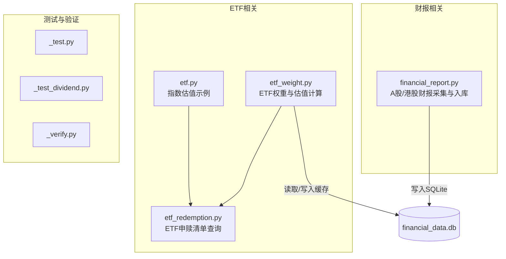
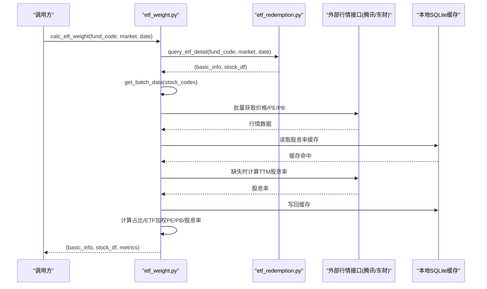
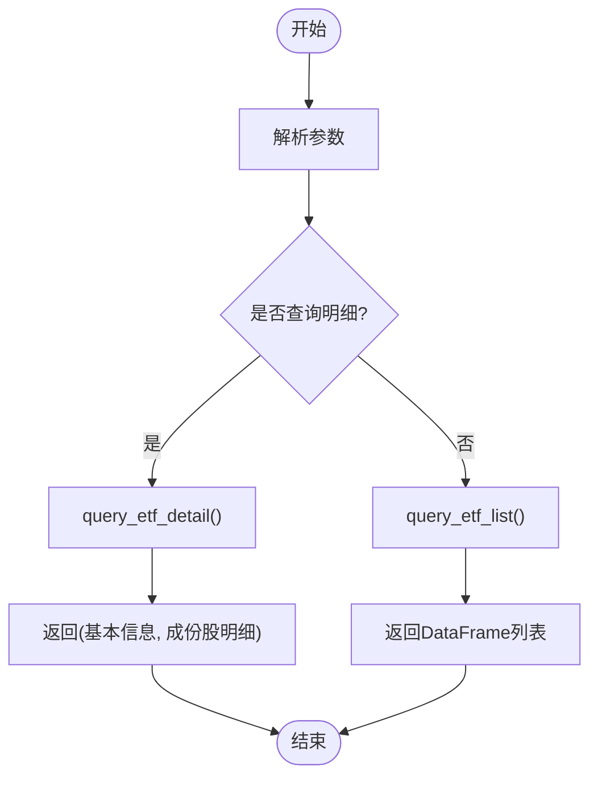
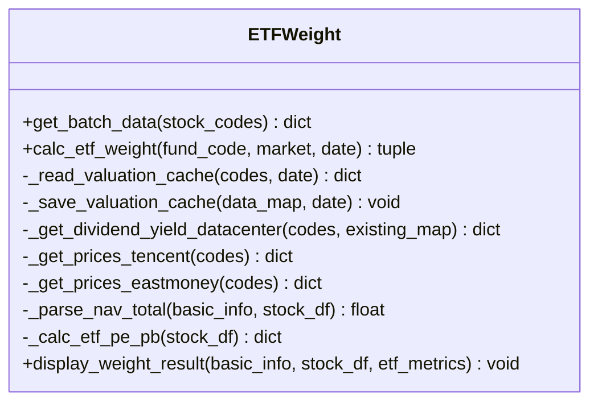
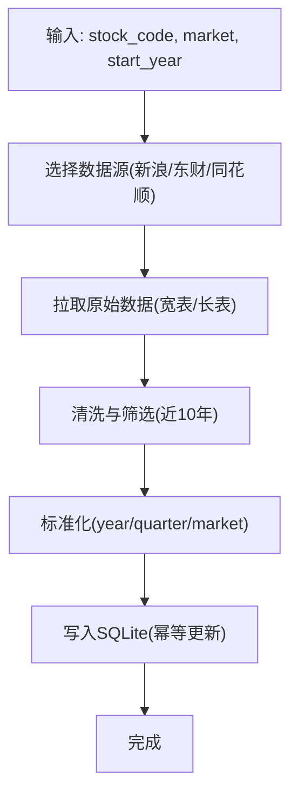
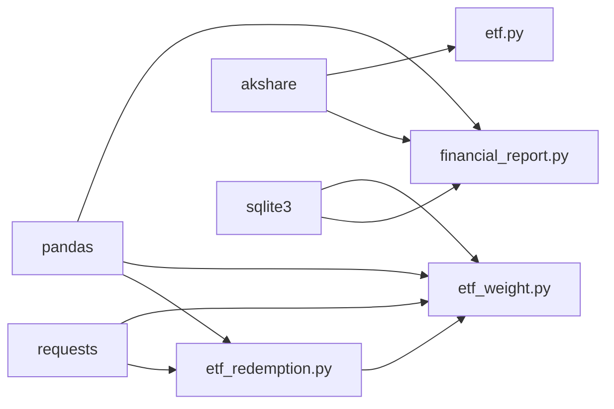

# API参考

<cite>
**本文引用的文件**   
- [etf.py](file://etf.py)
- [financial_report.py](file://financial_report.py)
- [etf_weight.py](file://etf_weight.py)
- [etf_redemption.py](file://etf_redemption.py)
- [_test.py](file://_test.py)
- [_test_dividend.py](file://_test_dividend.py)
- [_verify.py](file://_verify.py)
</cite>

## 目录
1. [简介](#简介)
2. [项目结构](#项目结构)
3. [核心组件](#核心组件)
4. [架构总览](#架构总览)
5. [详细组件分析](#详细组件分析)
6. [依赖关系分析](#依赖关系分析)
7. [性能与可用性建议](#性能与可用性建议)
8. [故障排查指南](#故障排查指南)
9. [结论](#结论)
10. [附录：CLI参数与用法](#附录cli参数与用法)

## 简介
本项目围绕ETF申赎清单、成份股估值指标（PE/PB/股息率）以及A股/港股财报数据采集与本地存储，提供两类使用方式：
- Python模块导入接口：面向集成与二次开发，返回pandas.DataFrame或dict等结构化数据。
- 命令行工具（CLI）：面向快速查询与批量处理，支持列表查询、详情查询、结果导出CSV等。

本API参考文档将完整记录所有公共函数签名、参数说明、返回值格式、错误处理约定、CLI参数与示例，并给出常见问题的解决方案。

## 项目结构
仓库包含四个主要功能模块与若干测试脚本：
- etf_redemption.py：上交所/深交所ETF申赎清单查询与解析（列表与明细）。
- etf_weight.py：基于ETF申赎清单计算成份股占比及ETF加权PE/PB/股息率，含行情获取与本地缓存。
- financial_report.py：A股/港股财报数据采集与SQLite持久化，提供多数据源统一字段。
- etf.py：指数成分股估值指标加权计算示例与演示片段。
- _test*.py：辅助验证与示例脚本。

图表来源
- [etf_redemption.py:1-683](file://etf_redemption.py#L1-L683)
- [etf_weight.py:1-674](file://etf_weight.py#L1-L674)
- [financial_report.py:1-644](file://financial_report.py#L1-L644)
- [etf.py:1-126](file://etf.py#L1-L126)

章节来源
- [etf_redemption.py:1-683](file://etf_redemption.py#L1-L683)
- [etf_weight.py:1-674](file://etf_weight.py#L1-L674)
- [financial_report.py:1-644](file://financial_report.py#L1-L644)
- [etf.py:1-126](file://etf.py#L1-L126)

## 核心组件
本节概述各模块对外暴露的公共接口及其职责边界。

- ETF申赎清单（etf_redemption.py）
  - 列表查询：支持按市场、基金代码、关键字、分类、日期筛选。
  - 明细查询：自动识别市场，返回基本信息与成份股明细DataFrame。
  - 下载PCF：上交所/深交所PCF文本文件下载与解析。
- ETF权重与估值（etf_weight.py）
  - 批量行情获取：价格、PE、PB优先从腾讯财经获取，缺失时东方财富兜底；股息率通过本地缓存+TTM分红计算补全。
  - 权重计算：根据最小申赎单位净值或市值合计为分母，计算每只成份股占比，汇总ETF整体PE/PB/股息率。
- 财报采集（financial_report.py）
  - 财务指标：新浪/东财主要指标宽表。
  - 三大报表：新浪/同花顺/东财多源采集，统一year/quarter口径，落库至SQLite。
  - 港股：东财主要指标与长表三大报表。
- 指数估值示例（etf.py）
  - 展示如何对指数成分股进行加权PE/PB/股息率计算（示例片段）。

章节来源
- [etf_redemption.py:1-683](file://etf_redemption.py#L1-L683)
- [etf_weight.py:1-674](file://etf_weight.py#L1-L674)
- [financial_report.py:1-644](file://financial_report.py#L1-L644)
- [etf.py:1-126](file://etf.py#L1-L126)

## 架构总览
ETF权重计算流程涉及“清单查询 -> 行情获取 -> 缓存读写 -> 权重与估值计算”的链路。

图表来源
- [etf_weight.py:446-511](file://etf_weight.py#L446-L511)
- [etf_redemption.py:529-549](file://etf_redemption.py#L529-L549)
- [etf_weight.py:393-443](file://etf_weight.py#L393-L443)
- [etf_weight.py:513-558](file://etf_weight.py#L513-L558)

## 详细组件分析

### ETF申赎清单查询（etf_redemption.py）
- 列表查询
  - 函数：query_etf_list(market="all", fund_code="", keyword="", etf_class="", date=None)
    - 参数：
      - market: "sh"/"sz"/"all"
      - fund_code: 6位数字字符串
      - keyword: 基金名称关键字（仅上交所）
      - etf_class: 分类代码（仅上交所），如"01"/"02"/"06"/"33"
      - date: "YYYY-MM-DD"（仅深交所）
    - 返回：pandas.DataFrame，列含“基金代码/基金名称/交易日期/市场/PCF文件链接”等
- 明细查询
  - 函数：query_etf_detail(fund_code, market=None, date=None)
    - 参数：fund_code必填；market可选，不传则按代码前缀推断；date用于深交所
    - 返回：(basic_info: dict, stock_df: pandas.DataFrame)
- 下载PCF
  - 函数：download_sse_pcf(fund_code, save_path=None) / download_szse_pcf(fund_code, date=None)
    - 返回：保存路径或None；深交所返回(basic_info, stock_df)
- 展示与导出
  - 函数：display_result(df, max_rows=50) / save_to_csv(df, filename=None)

图表来源
- [etf_redemption.py:608-683](file://etf_redemption.py#L608-L683)
- [etf_redemption.py:489-526](file://etf_redemption.py#L489-L526)
- [etf_redemption.py:529-549](file://etf_redemption.py#L529-L549)

章节来源
- [etf_redemption.py:33-111](file://etf_redemption.py#L33-L111)
- [etf_redemption.py:114-212](file://etf_redemption.py#L114-L212)
- [etf_redemption.py:256-344](file://etf_redemption.py#L256-L344)
- [etf_redemption.py:347-476](file://etf_redemption.py#L347-L476)
- [etf_redemption.py:489-526](file://etf_redemption.py#L489-L526)
- [etf_redemption.py:529-549](file://etf_redemption.py#L529-L549)
- [etf_redemption.py:564-604](file://etf_redemption.py#L564-L604)
- [etf_redemption.py:608-683](file://etf_redemption.py#L608-L683)

### ETF权重与估值计算（etf_weight.py）
- 批量行情获取
  - 函数：get_batch_data(stock_codes)
    - 参数：stock_codes: 证券代码列表
    - 返回：{code: {price, pe, pb, dy}}，dy可能为空
- 权重计算
  - 函数：calc_etf_weight(fund_code, market=None, date=None)
    - 参数：fund_code必填；market可选；date可选（深交所）
    - 返回：(basic_info: dict, stock_df: DataFrame, etf_metrics: dict)
- 内部工具
  - _read_valuation_cache / _save_valuation_cache：本地SQLite缓存读写
  - _get_dividend_yield_datacenter：通过东方财富datacenter-web计算TTM股息率
  - _get_prices_tencent / _get_prices_eastmoney：行情获取主备通道
  - _parse_nav_total / _calc_etf_pe_pb：占比分母解析与ETF加权指标计算
  - display_weight_result：格式化输出

图表来源
- [etf_weight.py:393-443](file://etf_weight.py#L393-L443)
- [etf_weight.py:446-511](file://etf_weight.py#L446-L511)
- [etf_weight.py:513-558](file://etf_weight.py#L513-L558)
- [etf_weight.py:561-585](file://etf_weight.py#L561-L585)
- [etf_weight.py:588-638](file://etf_weight.py#L588-L638)

章节来源
- [etf_weight.py:32-100](file://etf_weight.py#L32-L100)
- [etf_weight.py:111-237](file://etf_weight.py#L111-L237)
- [etf_weight.py:253-323](file://etf_weight.py#L253-L323)
- [etf_weight.py:326-390](file://etf_weight.py#L326-L390)
- [etf_weight.py:393-443](file://etf_weight.py#L393-L443)
- [etf_weight.py:446-511](file://etf_weight.py#L446-L511)
- [etf_weight.py:513-558](file://etf_weight.py#L513-L558)
- [etf_weight.py:561-585](file://etf_weight.py#L561-L585)
- [etf_weight.py:588-638](file://etf_weight.py#L588-L638)

### 财报数据采集与存储（financial_report.py）
- 数据库连接与写入
  - get_conn(db_path=DB_PATH): 返回sqlite3.Connection（启用WAL）
  - save_to_db(df, table, stock_code, market, conn): 插入前删除旧记录，幂等更新
- 财务指标
  - get_financial_report(stock_code, start_year=None): 新浪86项指标宽表
  - get_financial_report_em(stock_code, market="sh"): 东财140项指标宽表（近10年）
- 三大报表（A股）
  - get_financial_statements_sina(stock_code, market_prefix="sh"): 新浪宽表，新增year/quarter
  - get_financial_statements_ths(stock_code): 同花顺长表，新增year/quarter
  - get_financial_statements_em(stock_code, market="sh"): 东财宽表，新增year/quarter
- 三大报表（港股）
  - get_financial_report_hk(stock_code): 东财36项指标宽表（近10年）
  - get_financial_statements_hk(stock_code): 东财长表三大报表（近10年）

图表来源
- [financial_report.py:88-143](file://financial_report.py#L88-L143)
- [financial_report.py:151-236](file://financial_report.py#L151-L236)
- [financial_report.py:245-382](file://financial_report.py#L245-L382)
- [financial_report.py:390-478](file://financial_report.py#L390-L478)
- [financial_report.py:485-600](file://financial_report.py#L485-L600)

章节来源
- [financial_report.py:88-143](file://financial_report.py#L88-L143)
- [financial_report.py:151-236](file://financial_report.py#L151-L236)
- [financial_report.py:245-382](file://financial_report.py#L245-L382)
- [financial_report.py:390-478](file://financial_report.py#L390-L478)
- [financial_report.py:485-600](file://financial_report.py#L485-L600)

### 指数估值示例（etf.py）
- last_quarter(): 判断当前季度与年份
- hk_index_pe_pb_div(index_code="159699"): 示例性计算某指数的加权PE/PB/股息率（打印为主）
- 其他片段：调用akshare获取指数信息与成分股权重（注释片段）

章节来源
- [etf.py:7-16](file://etf.py#L7-L16)
- [etf.py:19-71](file://etf.py#L19-L71)
- [etf.py:73-126](file://etf.py#L73-L126)

## 依赖关系分析
- 外部依赖
  - akshare：A股/港股财务指标与指数数据
  - requests：网络请求（ETF清单、行情、分红数据）
  - pandas：数据处理与展示
  - sqlite3：本地数据存储
- 模块耦合
  - etf_weight.py 依赖 etf_redemption.py 获取ETF明细
  - financial_report.py 独立运行，负责数据采集与入库
  - etf.py 为示例脚本，可复用akshare能力

图表来源
- [etf_weight.py:1-24](file://etf_weight.py#L1-L24)
- [etf_redemption.py:1-29](file://etf_redemption.py#L1-L29)
- [financial_report.py:67-73](file://financial_report.py#L67-L73)
- [etf.py:1-5](file://etf.py#L1-L5)

章节来源
- [etf_weight.py:1-24](file://etf_weight.py#L1-L24)
- [etf_redemption.py:1-29](file://etf_redemption.py#L1-L29)
- [financial_report.py:67-73](file://financial_report.py#L67-L73)
- [etf.py:1-5](file://etf.py#L1-L5)

## 性能与可用性建议
- 网络请求
  - 批量行情采用批次请求与重试机制，建议合理设置超时与间隔，避免触发限流。
  - 东方财富datacenter分页拉取需控制页大小与间隔，降低失败率。
- 本地缓存
  - 股息率缓存以日期为键，减少重复计算；建议在每日开盘后刷新一次。
- 数据库
  - SQLite启用WAL模式提升并发读性能；大批量写入建议使用事务与批量插入。
- 数据一致性
  - 财报入库采用“先删后插”策略保证幂等；注意market统一小写存储。

[本节为通用建议，无需特定文件引用]

## 故障排查指南
- 网络异常
  - 现象：请求超时或JSONP解析失败
  - 排查：检查User-Agent/Referer头、目标站点可达性；确认响应是否为JSONP并正确提取JSON部分
  - 定位参考：
    - [etf_redemption.py:71-91](file://etf_redemption.py#L71-L91)
    - [etf_redemption.py:289-298](file://etf_redemption.py#L289-L298)
- 行情缺失
  - 现象：腾讯财经未返回足够数据，触发东方财富兜底
  - 排查：核对股票代码与市场映射逻辑；检查返回字段索引是否正确
  - 定位参考：
    - [etf_weight.py:253-323](file://etf_weight.py#L253-L323)
    - [etf_weight.py:326-390](file://etf_weight.py#L326-L390)
- 股息率为空
  - 现象：缓存无股息率或TTM计算失败
  - 排查：确认分红实施状态与除权日有效性；检查股价是否大于0
  - 定位参考：
    - [etf_weight.py:111-237](file://etf_weight.py#L111-L237)
- 数据库写入失败
  - 现象：to_sql报错或表不存在
  - 排查：确认表名与列名一致；确保conn已创建且WAL模式生效
  - 定位参考：
    - [financial_report.py:88-143](file://financial_report.py#L88-L143)

章节来源
- [etf_redemption.py:71-91](file://etf_redemption.py#L71-L91)
- [etf_redemption.py:289-298](file://etf_redemption.py#L289-L298)
- [etf_weight.py:253-323](file://etf_weight.py#L253-L323)
- [etf_weight.py:326-390](file://etf_weight.py#L326-L390)
- [etf_weight.py:111-237](file://etf_weight.py#L111-L237)
- [financial_report.py:88-143](file://financial_report.py#L88-L143)

## 结论
本项目提供了完整的ETF申赎清单查询、成份股权重与估值计算、以及A股/港股财报数据采集与入库能力。通过清晰的模块划分与统一的字段规范，既适合命令行快速使用，也便于Python集成二次开发。建议在生产环境中结合缓存与重试策略，保障稳定性与性能。

[本节为总结，无需特定文件引用]

## 附录：CLI参数与用法

### ETF申赎清单（etf_redemption.py）
- 入口：python etf_redemption.py
- 常用参数
  - --market: sh/sz/all（默认all）
  - --fund-code: 6位数字
  - --keyword: 关键字搜索（仅上交所）
  - --etf-class: 分类代码（仅上交所）
  - --date: YYYY-MM-DD（仅深交所）
  - --detail: 查询单只ETF明细
  - --save: 保存CSV
  - --max-rows: 最大显示行数（默认50）
- 示例
  - 查询全部ETF清单：python etf_redemption.py --market all
  - 查询上交所股票ETF：python etf_redemption.py --market sh --etf-class 01
  - 查询深交所指定ETF明细：python etf_redemption.py --detail --fund-code 159008 --date 2026-06-27
  - 保存结果：python etf_redemption.py --save

章节来源
- [etf_redemption.py:608-683](file://etf_redemption.py#L608-L683)

### ETF权重计算（etf_weight.py）
- 入口：python etf_weight.py
- 常用参数
  - --fund-code: 必填，6位数字
  - --market: sh/sz（默认自动判断）
  - --date: YYYY-MM-DD（仅深交所）
  - --save: 保存CSV
- 示例
  - 计算沪深300ETF权重：python etf_weight.py --fund-code 510300
  - 指定深圳市场并保存：python etf_weight.py --fund-code 159008 --market sz --save

章节来源
- [etf_weight.py:640-674](file://etf_weight.py#L640-L674)

### 财报采集（financial_report.py）
- 入口：python financial_report.py
- 配置区域
  - STOCKS: 列表项为(股票代码, 市场, 起始年)，市场支持sh/sz/hk
- 示例
  - 采集贵州茅台近10年财报：修改STOCKS加入("600519","sh","2016")后运行
  - 采集腾讯控股近10年财报：添加("00700","hk","2016")

章节来源
- [financial_report.py:485-600](file://financial_report.py#L485-L600)

### Python模块导入接口（示例）
- ETF权重计算
  - from etf_weight import calc_etf_weight, get_batch_data
  - 调用calc_etf_weight("510300")，返回(基本信息, 成份股明细, ETF指标)
- ETF清单查询
  - from etf_redemption import query_etf_list, query_etf_detail
  - 调用query_etf_detail("159008", market="sz", date="2026-06-27")
- 财报采集
  - from financial_report import get_financial_report, get_financial_statements_em, get_conn, save_to_db
  - 调用get_financial_report("600519", start_year="2016")

章节来源
- [etf_weight.py:446-511](file://etf_weight.py#L446-L511)
- [etf_redemption.py:529-549](file://etf_redemption.py#L529-L549)
- [financial_report.py:151-236](file://financial_report.py#L151-L236)
- [financial_report.py:88-143](file://financial_report.py#L88-L143)

### 数据接口规范（请求/响应/错误）
- 请求格式
  - HTTP GET：ETF清单、行情、分红数据均通过GET请求，参数以URL Query形式传递
  - 必要Headers：User-Agent、Referer（部分站点需要）
- 响应结构
  - JSON：ETF清单与行情多为JSON；上交所部分接口返回JSONP，需提取JSON部分
  - 文本：深交所PCF为GBK编码文本，需按行解析
- 错误码定义
  - 未定义HTTP状态码语义；模块内通过异常捕获与日志提示区分失败场景
  - 建议调用方依据返回空DataFrame或None判定失败

章节来源
- [etf_redemption.py:71-91](file://etf_redemption.py#L71-L91)
- [etf_redemption.py:289-298](file://etf_redemption.py#L289-L298)
- [etf_redemption.py:376-385](file://etf_redemption.py#L376-L385)

### 集成示例与常见问题
- 集成示例
  - 组合ETF清单与权重：先调用query_etf_detail获取明细，再传入calc_etf_weight计算权重与估值
  - 财报入库：调用get_financial_*系列函数获取数据，使用save_to_db写入SQLite
- 常见问题
  - 深交所PCF无法下载：检查日期格式与URL拼接；确认静态资源域名可达
  - 腾讯行情缺失较多：自动切换东方财富兜底；必要时调整批次大小与间隔
  - 股息率计算为空：确认分红实施状态与除权日有效；检查股价大于0

章节来源
- [etf_weight.py:393-443](file://etf_weight.py#L393-L443)
- [etf_weight.py:446-511](file://etf_weight.py#L446-L511)
- [financial_report.py:88-143](file://financial_report.py#L88-L143)
- [etf_redemption.py:347-385](file://etf_redemption.py#L347-L385)