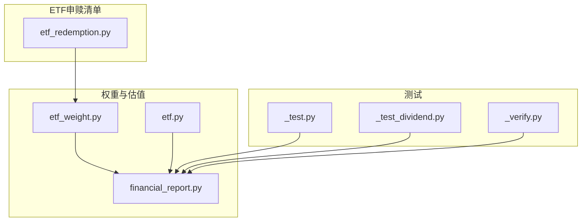
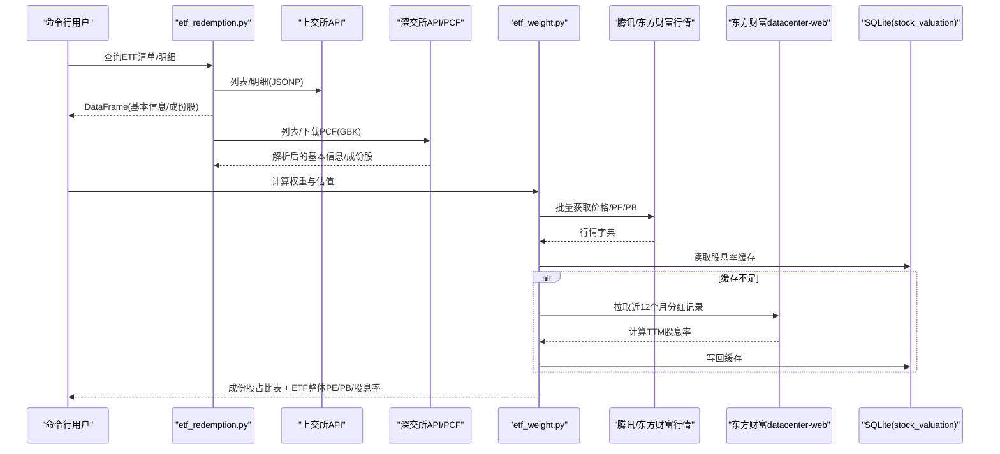
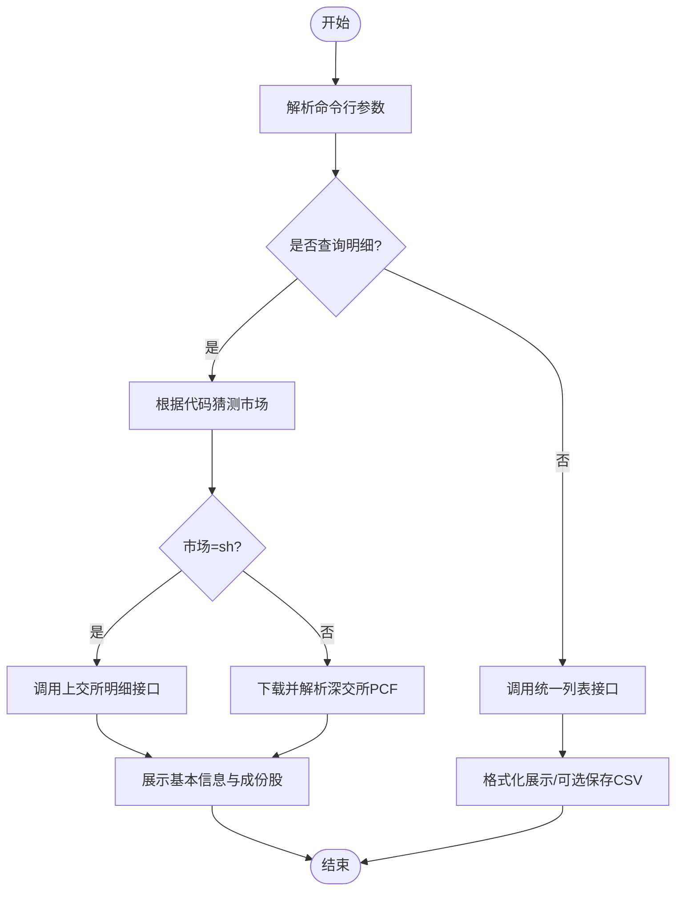
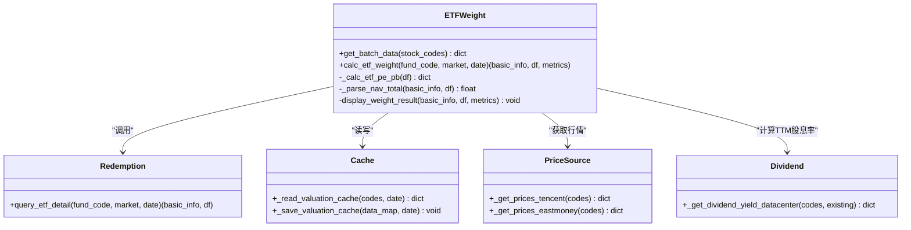
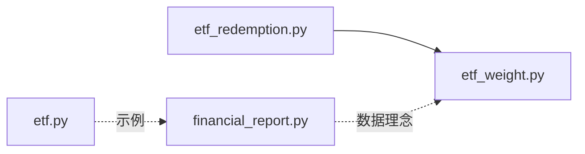

# ETF分析工具

<cite>
**本文引用的文件**   
- [etf.py](file://etf.py)
- [etf_redemption.py](file://etf_redemption.py)
- [etf_weight.py](file://etf_weight.py)
- [financial_report.py](file://financial_report.py)
- [_test.py](file://_test.py)
- [_test_dividend.py](file://_test_dividend.py)
- [_verify.py](file://_verify.py)
</cite>

## 目录
1. [简介](#简介)
2. [项目结构](#项目结构)
3. [核心组件](#核心组件)
4. [架构总览](#架构总览)
5. [详细组件分析](#详细组件分析)
6. [依赖关系分析](#依赖关系分析)
7. [性能与优化建议](#性能与优化建议)
8. [故障排查指南](#故障排查指南)
9. [结论](#结论)
10. [附录：命令行接口与使用示例](#附录命令行接口与使用示例)

## 简介
本ETF分析工具集围绕三大核心能力构建：
- ETF申赎清单查询：覆盖上交所与深交所，支持列表查询、单只ETF明细（成份股）查询、PCF文本下载与解析。
- 成份股权重计算：基于ETF最小申赎单位或成份股市值之和，计算每只成份股的占比，并汇总得到ETF整体PE/PB/股息率等指标。
- 加权估值指标分析：对ETF持仓进行加权平均与调和平均处理，结合TTM股息率计算，输出可解释的估值结果。

工具提供命令行入口，便于批量查询、导出CSV、以及集成到自动化流程中。

## 项目结构
仓库包含四个主要模块与若干测试脚本：
- etf_redemption.py：ETF申赎清单查询与PCF解析（上交所/深交所）。
- etf_weight.py：基于申赎清单计算成份股权重与ETF加权估值指标。
- financial_report.py：A股/港股财报数据采集与本地SQLite存储（为估值与股息率计算提供数据基础）。
- etf.py：港股指数/ETF相关示例与快速验证脚本。
- _test*.py：辅助测试与验证脚本。

图表来源
- [etf_redemption.py:1-683](file://etf_redemption.py#L1-L683)
- [etf_weight.py:1-674](file://etf_weight.py#L1-L674)
- [financial_report.py:1-644](file://financial_report.py#L1-L644)
- [etf.py:1-126](file://etf.py#L1-L126)
- [_test.py:1-6](file://_test.py#L1-L6)
- [_test_dividend.py:1-5](file://_test_dividend.py#L1-L5)
- [_verify.py:1-11](file://_verify.py#L1-L11)

章节来源
- [etf_redemption.py:1-683](file://etf_redemption.py#L1-L683)
- [etf_weight.py:1-674](file://etf_weight.py#L1-L674)
- [financial_report.py:1-644](file://financial_report.py#L1-L644)
- [etf.py:1-126](file://etf.py#L1-L126)

## 核心组件
- ETF申赎清单查询（etf_redemption.py）
  - 统一接口 query_etf_list：按市场、基金代码、关键字、分类、日期筛选，返回DataFrame。
  - 单只ETF明细 query_etf_detail：自动识别市场，返回基本信息与成份股明细。
  - 深交所PCF下载与解析 download_szse_pcf/_parse_szse_pcf_text：从静态站点下载并解析GBK编码文本。
  - 上交所API查询与PCF下载：query_sse_etf_list/query_sse_etf_detail/download_sse_pcf。
- 成份股权重与估值（etf_weight.py）
  - calc_etf_weight：调用申赎清单，批量获取行情（价格/PE/PB），计算市值与占比，汇总ETF整体PE/PB/股息率。
  - get_batch_data：优先腾讯财经批量接口，缺失时东方财富兜底；读取本地缓存股息率，缺失则通过datacenter-web计算TTM股息率。
  - SQLite缓存 stock_valuation：持久化个股PE/PB/股息率/价格，避免重复网络请求。
- 财报数据（financial_report.py）
  - 多源采集（新浪/同花顺/东方财富/A股+港股），统一写入SQLite，提供year/quarter字段，便于历史回溯。
- 港股指数/ETF示例（etf.py）
  - 展示如何获取季度持仓、计算加权PE/PB/股息率等示例逻辑。

章节来源
- [etf_redemption.py:1-683](file://etf_redemption.py#L1-L683)
- [etf_weight.py:1-674](file://etf_weight.py#L1-L674)
- [financial_report.py:1-644](file://financial_report.py#L1-L644)
- [etf.py:1-126](file://etf.py#L1-L126)

## 架构总览
ETF分析工具的整体数据流如下：
- 输入：ETF代码、市场、日期、关键词等参数。
- 数据源：交易所公开API（上交所/深交所）、第三方行情接口（腾讯/东方财富）、分红数据接口（东方财富datacenter-web）。
- 处理：解析PCF/JSON、清洗字段、计算市值与占比、聚合ETF整体估值指标。
- 输出：控制台表格、CSV文件、SQLite缓存。

图表来源
- [etf_redemption.py:33-213](file://etf_redemption.py#L33-L213)
- [etf_redemption.py:256-476](file://etf_redemption.py#L256-L476)
- [etf_weight.py:393-443](file://etf_weight.py#L393-L443)
- [etf_weight.py:446-511](file://etf_weight.py#L446-L511)
- [etf_weight.py:111-237](file://etf_weight.py#L111-L237)

## 详细组件分析

### ETF申赎清单查询（etf_redemption.py）
- 功能要点
  - 统一查询接口 query_etf_list：支持 market=all/sh/sz、fund_code、keyword、etf_class、date。
  - 单只ETF明细 query_etf_detail：自动判断市场，返回基本信息与成份股明细。
  - 上交所：JSONP响应解析，字段映射为中文友好名称；支持下载PCF文本。
  - 深交所：列表HTML解析提取encode-open路径，拼接PCF URL后下载并解析GBK文本。
- 关键函数与职责
  - query_sse_etf_list：分页参数、JSONP正则提取、构造DataFrame。
  - query_sse_etf_detail：基本信息与成份股明细两个SQL ID分别请求。
  - download_sse_pcf：直接下载PCF文本文件。
  - query_szse_etf_list：列表接口返回metadata/data结构，解析HTML属性。
  - download_szse_pcf/_parse_szse_pcf_text：状态机解析头部/上一交易日/当日信息/成份股表头/数据行。
  - display_result/save_to_csv：格式化展示与保存CSV。
- 错误处理
  - 网络异常捕获、JSON解析失败、空结果提示、重试机制（部分接口）。
- 输出格式
  - 列表：基金代码、基金名称、管理公司、净值、交易日期、市场等。
  - 明细：证券代码、名称、数量、现金替代标志、保证金率、替代金额等。

图表来源
- [etf_redemption.py:608-683](file://etf_redemption.py#L608-L683)
- [etf_redemption.py:529-562](file://etf_redemption.py#L529-L562)
- [etf_redemption.py:33-111](file://etf_redemption.py#L33-L111)
- [etf_redemption.py:114-213](file://etf_redemption.py#L114-L213)
- [etf_redemption.py:256-344](file://etf_redemption.py#L256-L344)
- [etf_redemption.py:347-476](file://etf_redemption.py#L347-L476)

章节来源
- [etf_redemption.py:33-213](file://etf_redemption.py#L33-L213)
- [etf_redemption.py:256-476](file://etf_redemption.py#L256-L476)
- [etf_redemption.py:489-527](file://etf_redemption.py#L489-L527)
- [etf_redemption.py:529-562](file://etf_redemption.py#L529-L562)
- [etf_redemption.py:608-683](file://etf_redemption.py#L608-L683)

### 成份股权重与ETF加权估值（etf_weight.py）
- 功能要点
  - 基于ETF最小申赎单位净值或成份股市值之和作为分母，计算每只成份股占比。
  - 批量获取行情（价格/PE/PB），优先腾讯接口，缺失时用东方财富兜底。
  - 本地SQLite缓存股息率，缺失时通过datacenter-web计算TTM股息率。
  - 汇总ETF整体PE/PB（调和平均）与加权股息率（算术加权）。
- 关键函数与职责
  - get_batch_data：组合价格/PE/PB与股息率，读写缓存。
  - calc_etf_weight：整合申赎清单与行情，计算占比与ETF指标。
  - _calc_etf_pe_pb：过滤有效数据，计算整体PE/PB/加权股息率。
  - _parse_nav_total：解析“最小申赎单位净值”作为分母，否则回退到市值之和。
  - display_weight_result：格式化展示前十大权重股与合计统计。
- 算法说明
  - 整体PE = Σ占比 / Σ(占比/PE)，等价于总市值÷总净利润（排除亏损股）。
  - 整体PB = Σ占比 / Σ(占比/PB)，等价于总市值÷总净资产（排除净资产为负）。
  - 加权股息率 = Σ(占比×股息率) / Σ(占比)。
- 缓存策略
  - stock_valuation表：stock_code, date, pe, pb, dividend_yield, price, updated_at。
  - 仅缓存股息率有效的记录，确保下次重新拉取缺失项。

图表来源
- [etf_weight.py:393-443](file://etf_weight.py#L393-L443)
- [etf_weight.py:446-511](file://etf_weight.py#L446-L511)
- [etf_weight.py:513-559](file://etf_weight.py#L513-L559)
- [etf_weight.py:561-586](file://etf_weight.py#L561-L586)
- [etf_weight.py:588-638](file://etf_weight.py#L588-L638)
- [etf_weight.py:51-100](file://etf_weight.py#L51-L100)
- [etf_weight.py:253-323](file://etf_weight.py#L253-L323)
- [etf_weight.py:326-390](file://etf_weight.py#L326-L390)
- [etf_weight.py:111-237](file://etf_weight.py#L111-L237)

章节来源
- [etf_weight.py:393-443](file://etf_weight.py#L393-L443)
- [etf_weight.py:446-511](file://etf_weight.py#L446-L511)
- [etf_weight.py:513-559](file://etf_weight.py#L513-L559)
- [etf_weight.py:561-586](file://etf_weight.py#L561-L586)
- [etf_weight.py:588-638](file://etf_weight.py#L588-L638)
- [etf_weight.py:51-100](file://etf_weight.py#L51-L100)
- [etf_weight.py:253-323](file://etf_weight.py#L253-L323)
- [etf_weight.py:326-390](file://etf_weight.py#L326-L390)
- [etf_weight.py:111-237](file://etf_weight.py#L111-L237)

### 财报数据采集与存储（financial_report.py）
- 功能要点
  - 多数据源采集A股/港股财务指标与三大报表，统一写入SQLite。
  - 新增year/quarter字段，便于时间序列分析与对比。
  - 提供便捷API用于后续估值与股息率计算的数据支撑。
- 关键函数与职责
  - get_financial_report/get_financial_report_em：A股主要指标（新浪/东财）。
  - get_financial_statements_sina/ths/em：三大报表（宽表/长表）。
  - get_financial_report_hk/get_financial_statements_hk：港股数据。
  - save_to_db/get_conn：数据库写入与连接管理（WAL模式）。
- 输出格式
  - 宽表：每行一期报告，列包含大量指标。
  - 长表：每行一个科目，含metric_name/value/yoy等。

章节来源
- [financial_report.py:88-143](file://financial_report.py#L88-L143)
- [financial_report.py:151-236](file://financial_report.py#L151-L236)
- [financial_report.py:245-382](file://financial_report.py#L245-L382)
- [financial_report.py:390-478](file://financial_report.py#L390-L478)
- [financial_report.py:485-600](file://financial_report.py#L485-L600)

### 港股指数/ETF示例（etf.py）
- 功能要点
  - 获取当前季度与指定季度持仓，合并Top10与Tail40，计算加权PE/PB/股息率。
  - 示例展示了如何使用akshare接口获取指数成分与估值。
- 注意
  - 该脚本为示例性质，未实现完整命令行接口，主要用于快速验证思路。

章节来源
- [etf.py:19-71](file://etf.py#L19-L71)
- [etf.py:73-126](file://etf.py#L73-L126)

## 依赖关系分析
- 外部库
  - akshare：A股/港股财报与指数数据。
  - baostock：示例中使用（etf.py）。
  - pandas：数据处理与展示。
  - requests：HTTP请求（上交所/深交所/腾讯/东方财富）。
  - sqlite3：本地缓存与数据存储。
- 模块间依赖
  - etf_weight.py 依赖 etf_redemption.py 获取申赎清单。
  - etf_weight.py 依赖 financial_report.py 提供的数据基础（虽未直接导入，但理念一致）。
  - etf.py 独立示例，使用 akshare/baostock/pandas。

图表来源
- [etf_weight.py:23](file://etf_weight.py#L23)
- [etf.py:1-126](file://etf.py#L1-126)
- [financial_report.py:1-644](file://financial_report.py#L1-644)

章节来源
- [etf_weight.py:23](file://etf_weight.py#L23)
- [etf.py:1-126](file://etf.py#L1-126)
- [financial_report.py:1-644](file://financial_report.py#L1-644)

## 性能与优化建议
- 网络请求优化
  - 批量接口优先：腾讯财经批量获取价格/PE/PB，减少请求次数。
  - 分页控制：datacenter-web分页限制最大页数，避免无效请求。
  - 会话复用：requests.Session提升连接复用效率。
- 缓存策略
  - SQLite缓存股息率，仅缓存有效记录，降低重复计算。
  - 读多写少场景下启用WAL模式，提高并发读性能。
- 容错与重试
  - 网络异常捕获与重试（最多3次），提升稳定性。
  - 缺失数据兜底：腾讯不足80%时切换东方财富。
- 计算优化
  - 过滤无效数据（PE/PB/股息率为负或缺失），避免除零与噪声影响。
  - 使用向量化pandas操作，减少循环开销。

[本节为通用指导，不直接分析具体文件]

## 故障排查指南
- 常见错误
  - JSONP解析失败：检查正则匹配与响应内容。
  - PCF下载失败：确认URL与编码（GBK），必要时替换字符。
  - 行情接口缺失：检查批次大小与字段索引，确认股票代码格式。
  - 缓存为空：确认日期格式与缓存键，确保write成功。
- 调试建议
  - 打印中间结果（如basic_info、stock_df、batch_data）。
  - 使用display_result/save_to_csv导出结果，便于离线分析。
  - 查看SQLite缓存表stock_valuation，确认数据写入情况。

章节来源
- [etf_redemption.py:71-91](file://etf_redemption.py#L71-L91)
- [etf_redemption.py:376-385](file://etf_redemption.py#L376-L385)
- [etf_weight.py:276-320](file://etf_weight.py#L276-L320)
- [etf_weight.py:77-100](file://etf_weight.py#L77-L100)

## 结论
本工具集提供了完整的ETF分析闭环：从申赎清单获取、成份股权重计算，到ETF整体估值指标输出。通过多数据源融合、本地缓存与稳健的错误处理，能够在生产环境中稳定运行。建议在实际使用中结合业务需求扩展更多指标（如ROE、毛利率等），并引入异步请求进一步提升性能。

[本节为总结性内容，不直接分析具体文件]

## 附录：命令行接口与使用示例

### ETF申赎清单查询（etf_redemption.py）
- 基本用法
  - 查询全部ETF申赎清单：python etf_redemption.py
  - 仅查询上交所：python etf_redemption.py --market sh
  - 仅查询深交所：python etf_redemption.py --market sz
  - 按基金代码查询：python etf_redemption.py --fund-code 510300
  - 按关键字查询（上交所）：python etf_redemption.py --keyword 沪深300
  - 指定日期（深交所）：python etf_redemption.py --date 2026-06-27
  - 按ETF分类（上交所）：python etf_redemption.py --etf-class 01
  - 查询单只ETF详细清单（成份股）：python etf_redemption.py --detail --fund-code 159008
  - 保存结果为CSV：python etf_redemption.py --save
- 参数说明
  - --market：sh/sz/all
  - --fund-code：6位数字
  - --keyword：基金名称关键字（仅上交所）
  - --etf-class：01股票/02债券/06商品/33跨境（仅上交所）
  - --date：YYYY-MM-DD（仅深交所）
  - --detail：查询单只ETF明细
  - --save：保存CSV
  - --max-rows：最大显示行数

章节来源
- [etf_redemption.py:608-683](file://etf_redemption.py#L608-L683)

### 成份股权重与ETF加权估值（etf_weight.py）
- 基本用法
  - 计算某ETF成份股权重与估值：python etf_weight.py --fund-code 510300
  - 指定市场：python etf_weight.py --fund-code 159008 --market sz
  - 指定日期（深交所）：python etf_weight.py --fund-code 159008 --date 2026-06-27
  - 保存结果为CSV：python etf_weight.py --fund-code 510300 --save
- 输出说明
  - 基本信息：基金名称、管理公司、交易日期、最小申赎单位净值等。
  - 成份股明细：证券代码、名称、数量、收盘价、PE、PB、股息率(%)、市值、占比(%)。
  - ETF指标：整体PE、整体PB、加权股息率(%)及覆盖率。

章节来源
- [etf_weight.py:640-674](file://etf_weight.py#L640-L674)
- [etf_weight.py:588-638](file://etf_weight.py#L588-L638)

### 财报数据采集（financial_report.py）
- 基本用法
  - 直接运行采集：python financial_report.py
  - 修改STOCKS列表以添加目标股票与市场。
- 输出说明
  - 本地SQLite数据库（financial_data.db），包含多个表（指标/三大报表）。
  - 统一字段：stock_code、market、year、quarter。

章节来源
- [financial_report.py:485-600](file://financial_report.py#L485-L600)

### 示例与验证脚本
- _test.py：验证akshare接口可用性。
- _test_dividend.py：获取个股分红明细。
- _verify.py：验证数据库内容与统计。

章节来源
- [_test.py:1-6](file://_test.py#L1-L6)
- [_test_dividend.py:1-5](file://_test_dividend.py#L1-L5)
- [_verify.py:1-11](file://_verify.py#L1-L11)