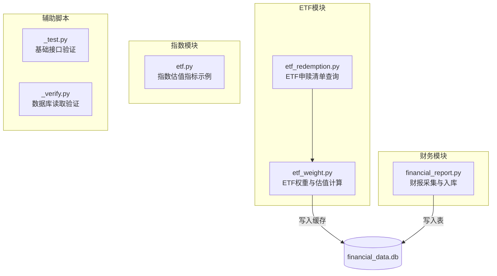
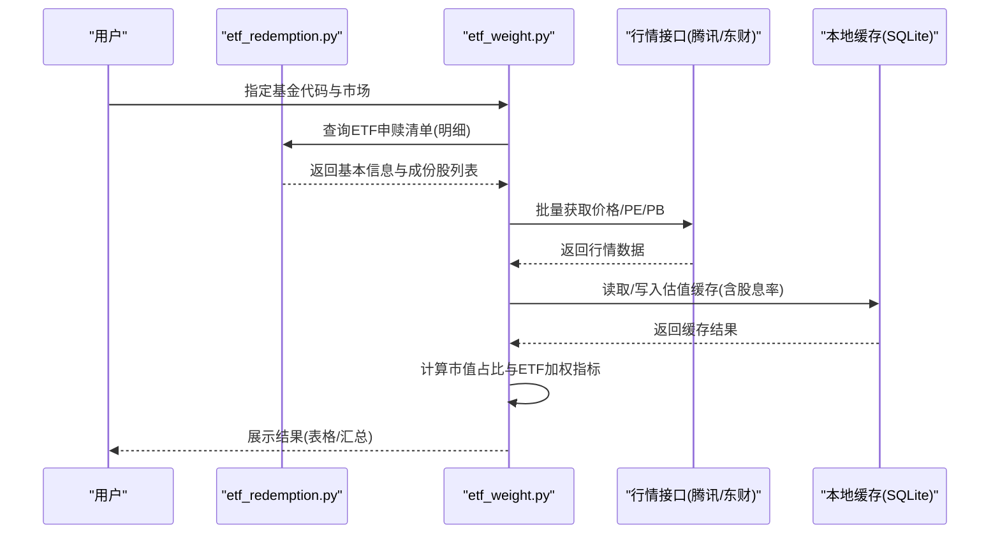
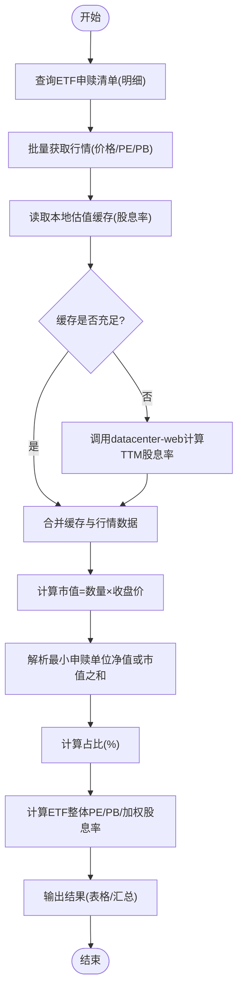

# 快速开始

<cite>
**本文引用的文件**   
- [etf.py](file://etf.py)
- [etf_redemption.py](file://etf_redemption.py)
- [etf_weight.py](file://etf_weight.py)
- [financial_report.py](file://financial_report.py)
- [_test.py](file://_test.py)
- [_verify.py](file://_verify.py)
</cite>

## 目录
1. [简介](#简介)
2. [项目结构](#项目结构)
3. [核心组件](#核心组件)
4. [架构总览](#架构总览)
5. [详细组件分析](#详细组件分析)
6. [依赖与安装](#依赖与安装)
7. [常用命令示例](#常用命令示例)
8. [性能与缓存](#性能与缓存)
9. [故障排除指南](#故障排除指南)
10. [结论](#结论)

## 简介
本工具集面向股票与ETF数据分析，提供以下能力：
- ETF申赎清单查询（上交所/深交所）
- ETF权重计算（基于申赎清单与行情数据）
- A股与港股财报数据采集与本地存储（SQLite）
- 指数估值指标计算（市盈率、市净率、股息率等加权指标）

目标：帮助新用户在最短时间内完成环境搭建并运行第一个示例。

## 项目结构
仓库包含四个核心脚本与若干辅助测试脚本：
- etf_redemption.py：ETF申赎清单查询（列表与明细），支持上交所与深交所
- etf_weight.py：基于ETF申赎清单计算成份股占比及ETF加权PE/PB/股息率
- financial_report.py：A股+港股财报数据采集与入库（多数据源）
- etf.py：指数相关估值指标计算示例
- _test.py / _verify.py：简单验证脚本

图表来源
- [etf_redemption.py:1-683](file://etf_redemption.py#L1-L683)
- [etf_weight.py:1-674](file://etf_weight.py#L1-L674)
- [financial_report.py:1-644](file://financial_report.py#L1-L644)
- [etf.py:1-126](file://etf.py#L1-L126)
- [_test.py:1-6](file://_test.py#L1-L6)
- [_verify.py:1-11](file://_verify.py#L1-L11)

章节来源
- [etf_redemption.py:1-683](file://etf_redemption.py#L1-L683)
- [etf_weight.py:1-674](file://etf_weight.py#L1-L674)
- [financial_report.py:1-644](file://financial_report.py#L1-L644)
- [etf.py:1-126](file://etf.py#L1-L126)
- [_test.py:1-6](file://_test.py#L1-L6)
- [_verify.py:1-11](file://_verify.py#L1-L11)

## 核心组件
- ETF申赎清单查询（etf_redemption.py）
  - 支持按市场、基金代码、关键字、分类、日期筛选
  - 返回ETF基本信息与成份股明细
- ETF权重计算（etf_weight.py）
  - 基于申赎清单与行情数据，计算每只成份股占ETF的市值占比
  - 输出ETF整体PE、PB与加权股息率
- 财报数据采集（financial_report.py）
  - 多数据源（新浪、同花顺、东方财富）采集A股与港股财报
  - 统一字段与格式，落库至SQLite，便于后续分析
- 指数估值示例（etf.py）
  - 演示如何获取指数成分与估值指标（市盈率、市净率、股息率）

章节来源
- [etf_redemption.py:1-683](file://etf_redemption.py#L1-L683)
- [etf_weight.py:1-674](file://etf_weight.py#L1-L674)
- [financial_report.py:1-644](file://financial_report.py#L1-L644)
- [etf.py:1-126](file://etf.py#L1-L126)

## 架构总览
ETF权重计算流程（从申赎清单到估值指标）：

图表来源
- [etf_redemption.py:529-549](file://etf_redemption.py#L529-L549)
- [etf_weight.py:446-511](file://etf_weight.py#L446-L511)
- [etf_weight.py:393-443](file://etf_weight.py#L393-L443)
- [etf_weight.py:513-558](file://etf_weight.py#L513-L558)

## 详细组件分析

### ETF申赎清单查询（etf_redemption.py）
- 功能要点
  - 上交所：通过API获取ETF列表与明细；支持JSONP解析
  - 深交所：通过API获取列表，下载PCF文本文件并解析
  - 统一接口：query_etf_list、query_etf_detail
- 关键函数
  - query_sse_etf_list / query_sse_etf_detail
  - query_szse_etf_list / download_szse_pcf / _parse_szse_pcf_text
  - query_etf_list / query_etf_detail
- 使用建议
  - 仅查询列表：传入 market/fund_code/keyword/etf_class/date
  - 查询单只ETF明细：传入 fund_code 与可选 market/date

章节来源
- [etf_redemption.py:33-112](file://etf_redemption.py#L33-L112)
- [etf_redemption.py:114-213](file://etf_redemption.py#L114-L213)
- [etf_redemption.py:256-344](file://etf_redemption.py#L256-L344)
- [etf_redemption.py:347-476](file://etf_redemption.py#L347-L476)
- [etf_redemption.py:489-549](file://etf_redemption.py#L489-L549)

### ETF权重计算（etf_weight.py）
- 功能要点
  - 基于ETF申赎清单与成份股数量，结合收盘价计算市值占比
  - 优先使用腾讯财经接口获取价格/PE/PB，不足时以东方财富兜底
  - 本地SQLite缓存估值数据（含TTM股息率）
- 关键函数
  - get_batch_data：批量获取行情与股息率，读写缓存
  - calc_etf_weight：计算ETF权重与估值指标
  - display_weight_result：格式化输出
- 算法说明
  - 整体PE/PB采用调和平均口径（总市值÷总净利润/净资产）
  - 加权股息率为算术加权平均

图表来源
- [etf_weight.py:446-511](file://etf_weight.py#L446-L511)
- [etf_weight.py:393-443](file://etf_weight.py#L393-L443)
- [etf_weight.py:513-558](file://etf_weight.py#L513-L558)
- [etf_weight.py:561-585](file://etf_weight.py#L561-L585)

章节来源
- [etf_weight.py:1-674](file://etf_weight.py#L1-L674)

### 财报数据采集（financial_report.py）
- 功能要点
  - 多数据源：新浪财经、同花顺、东方财富
  - 支持A股与港股，统一字段（stock_code、market、year、quarter）
  - 自动建表与幂等更新（先删后插）
- 关键函数
  - get_financial_report / get_financial_report_em / get_financial_report_hk
  - get_financial_statements_sina / get_financial_statements_ths / get_financial_statements_em / get_financial_statements_hk
  - save_to_db / get_conn
- 使用方式
  - 直接运行脚本，修改STOCKS列表即可批量采集
  - 作为模块导入，按需调用函数

章节来源
- [financial_report.py:1-644](file://financial_report.py#L1-L644)

### 指数估值示例（etf.py）
- 功能要点
  - 获取指数成分与估值指标（市盈率、市净率、股息率）
  - 演示季度判断与加权计算逻辑
- 适用场景
  - 快速查看某指数的加权估值水平

章节来源
- [etf.py:1-126](file://etf.py#L1-L126)

## 依赖与安装
- Python版本要求
  - 建议使用Python 3.8及以上（脚本未显式声明最低版本，但广泛使用pandas与akshare特性）
- 必需依赖库
  - akshare：金融数据接口
  - pandas：数据处理
  - requests：网络请求
  - sqlite3：标准库，无需额外安装
- 安装步骤
  - 创建虚拟环境（推荐）
    - python -m venv .venv
    - source .venv/bin/activate（Linux/macOS）或 .venv\Scripts\activate（Windows）
  - 安装依赖
    - pip install akshare pandas requests
  - 验证安装
    - 运行基础验证脚本：python _test.py
      - 该脚本会调用akshare获取A股代码名称列表，用于确认akshare可用
    - 如需验证数据库读取，可运行：python _verify.py（需先执行一次财报采集生成数据库）

章节来源
- [financial_report.py:53-65](file://financial_report.py#L53-L65)
- [_test.py:1-6](file://_test.py#L1-L6)
- [_verify.py:1-11](file://_verify.py#L1-L11)

## 常用命令示例
以下为命令行用法示例（请根据实际环境替换参数）：
- 查询全部ETF申赎清单
  - python etf_redemption.py --market all
- 仅查询上交所ETF清单
  - python etf_redemption.py --market sh
- 仅查询深交所ETF清单（可指定日期）
  - python etf_redemption.py --market sz --date 2026-06-27
- 按基金代码查询单只ETF明细（自动识别市场）
  - python etf_redemption.py --fund-code 510300 --detail
- 指定市场查询单只ETF明细（深交所需传date）
  - python etf_redemption.py --fund-code 159008 --market sz --date 2026-06-27 --detail
- 保存查询结果为CSV
  - python etf_redemption.py --market all --save
- 计算ETF权重（含估值指标）
  - python etf_weight.py --fund-code 510300
  - python etf_weight.py --fund-code 159008 --market sz
  - 保存权重结果
    - python etf_weight.py --fund-code 510300 --save
- 采集A股与港股财报数据
  - python financial_report.py
  - 在脚本中修改STOCKS列表，添加需要采集的股票与市场

章节来源
- [etf_redemption.py:608-683](file://etf_redemption.py#L608-L683)
- [etf_weight.py:640-674](file://etf_weight.py#L640-L674)
- [financial_report.py:485-601](file://financial_report.py#L485-L601)

## 性能与缓存
- ETF权重计算缓存
  - 本地SQLite缓存表：stock_valuation（字段包括股票代码、日期、PE、PB、股息率、价格、更新时间）
  - 读取策略：优先命中当日缓存，缺失则补全
  - 写入策略：批量写入，避免频繁IO
- 行情数据获取策略
  - 优先使用腾讯财经批量接口（价格/PE/PB）
  - 若覆盖率不足80%，自动切换东方财富接口兜底
  - 股息率通过东方财富datacenter-web接口计算TTM（滚动12个月）
- 建议
  - 首次运行可能较慢（需拉取大量行情与分红记录）
  - 后续运行将显著提速（利用本地缓存）

章节来源
- [etf_weight.py:29-101](file://etf_weight.py#L29-L101)
- [etf_weight.py:111-237](file://etf_weight.py#L111-L237)
- [etf_weight.py:253-323](file://etf_weight.py#L253-L323)
- [etf_weight.py:326-390](file://etf_weight.py#L326-L390)
- [etf_weight.py:393-443](file://etf_weight.py#L393-L443)

## 故障排除指南
- 无法连接网络或接口超时
  - 检查网络连通性与代理设置
  - 重试命令或稍后再试（脚本内置多次重试机制）
- 深交所ETF明细为空
  - 确认日期是否为交易日
  - 尝试指定 --date 为最近交易日
- 上交所ETF明细为空
  - 确认基金代码是否正确
  - 检查是否已发布当日申赎清单
- ETF权重计算结果为空
  - 确认基金代码所属市场（sh/sz）
  - 检查行情接口是否成功（控制台有“成功获取X/Y只”提示）
- 本地缓存异常
  - 删除当前目录下的 financial_data.db 后重新运行（将重建缓存）
- 财报采集失败
  - 检查akshare版本与网络
  - 减少STOCKS列表中的股票数量分批采集
- 数据库读取错误
  - 确保先执行一次采集脚本生成数据库
  - 使用_verify.py进行基本读取验证

章节来源
- [etf_redemption.py:608-683](file://etf_redemption.py#L608-L683)
- [etf_weight.py:640-674](file://etf_weight.py#L640-L674)
- [financial_report.py:485-601](file://financial_report.py#L485-L601)
- [_verify.py:1-11](file://_verify.py#L1-L11)

## 结论
通过以上步骤，您可以在10分钟内完成环境搭建并运行第一个示例：
- 安装依赖并验证akshare
- 查询ETF申赎清单
- 计算ETF权重与估值指标
- 采集A股与港股财报数据并存入本地数据库

建议先从单只ETF与单只股票入手，熟悉各脚本的输出与参数，再逐步扩展到批量任务。