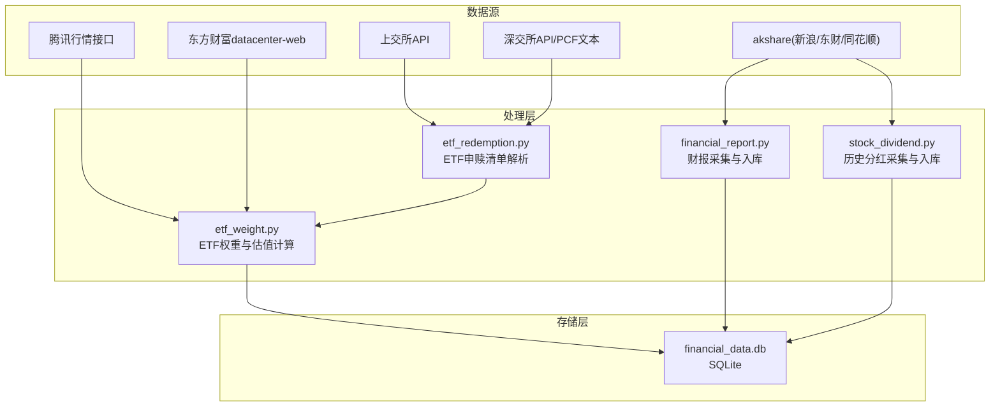
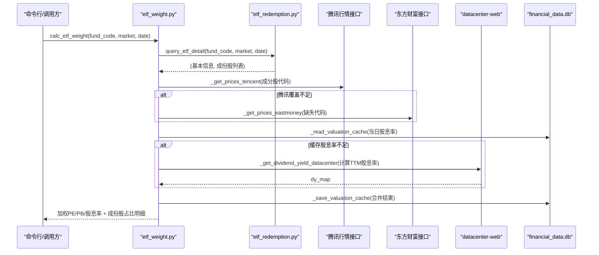
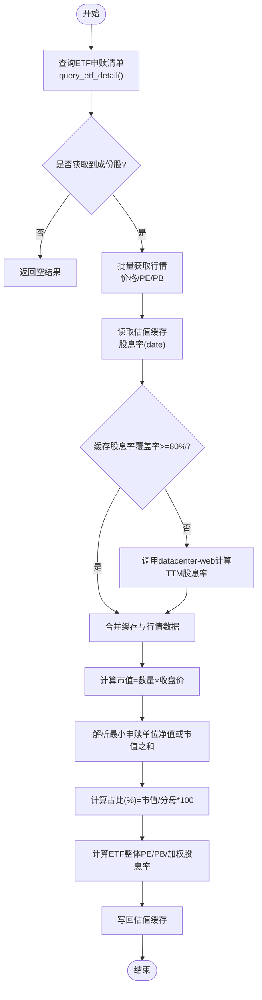
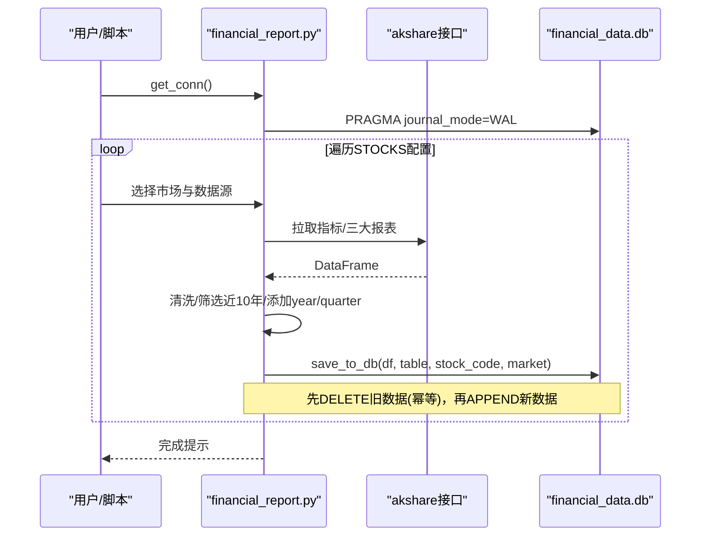
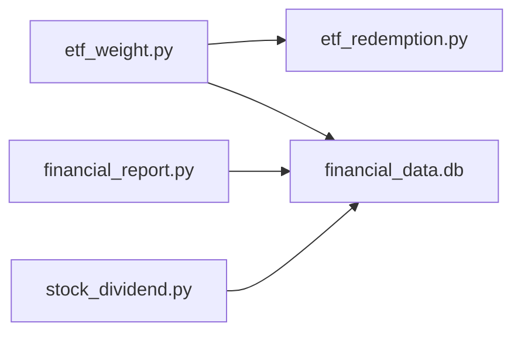

# 数据库设计

<cite>
**本文引用的文件**   
- [etf_weight.py](file://etf_weight.py)
- [financial_report.py](file://financial_report.py)
- [stock_dividend.py](file://stock_dividend.py)
- [etf_redemption.py](file://etf_redemption.py)
- [_cleanup.py](file://_cleanup.py)
- [_verify.py](file://_verify.py)
</cite>

## 目录
1. [引言](#引言)
2. [项目结构](#项目结构)
3. [核心组件](#核心组件)
4. [架构总览](#架构总览)
5. [详细组件分析](#详细组件分析)
6. [依赖关系分析](#依赖关系分析)
7. [性能考虑](#性能考虑)
8. [故障排查指南](#故障排查指南)
9. [结论](#结论)
10. [附录：常用SQL与最佳实践](#附录常用sql与最佳实践)

## 引言
本仓库围绕ETF权重计算、A股/港股财报数据采集与存储、以及历史分红明细采集，构建了一个以SQLite为核心的本地数据平台。数据库文件统一命名为 financial_data.db，位于脚本同级目录。系统通过多数据源（新浪、同花顺、东方财富、腾讯行情、深交所/上交所公开接口）聚合数据，并以幂等方式写入本地SQLite表，同时提供估值缓存机制以提升查询效率。

## 项目结构
- 数据存储：所有持久化数据均落盘至同一SQLite数据库文件 financial_data.db。
- 模块职责：
  - ETF申赎清单与权重计算：etf_redemption.py + etf_weight.py
  - 财报数据采集与入库：financial_report.py
  - 历史分红明细采集与入库：stock_dividend.py
  - 清理与验证辅助：_cleanup.py、_verify.py



图表来源
- [etf_redemption.py:33-212](file://etf_redemption.py#L33-L212)
- [etf_weight.py:29-100](file://etf_weight.py#L29-L100)
- [financial_report.py:78-143](file://financial_report.py#L78-L143)
- [stock_dividend.py:46-96](file://stock_dividend.py#L46-L96)

章节来源
- [etf_redemption.py:1-683](file://etf_redemption.py#L1-L683)
- [etf_weight.py:1-674](file://etf_weight.py#L1-L674)
- [financial_report.py:1-644](file://financial_report.py#L1-L644)
- [stock_dividend.py:1-244](file://stock_dividend.py#L1-L244)
- [_cleanup.py:1-11](file://_cleanup.py#L1-L11)
- [_verify.py:1-11](file://_verify.py#L1-L11)

## 核心组件
- ETF权重与估值缓存
  - 使用 stock_valuation 表作为本地缓存，记录股票在指定日期的PE、PB、股息率(TTM)、收盘价及更新时间。
  - 通过腾讯财经批量获取价格/PE/PB，缺失时以东方财富兜底；股息率优先从缓存读取，不足时调用东方财富datacenter-web计算TTM股息率并回写缓存。
- 财报数据入库
  - 支持A股与港股的多数据源（新浪、同花顺、东方财富），统一插入到若干财务指标与三大报表表中，并在写入前按(stock_code, market)或代码维度删除旧数据，实现幂等更新。
  - 连接启用WAL模式提升并发读性能。
- 历史分红明细入库
  - 从新浪财经接口拉取每只股票的历史分红明细，按“代码”幂等更新 stock_dividend_detail 表。

章节来源
- [etf_weight.py:29-100](file://etf_weight.py#L29-L100)
- [etf_weight.py:393-443](file://etf_weight.py#L393-L443)
- [financial_report.py:88-143](file://financial_report.py#L88-L143)
- [stock_dividend.py:74-96](file://stock_dividend.py#L74-L96)

## 架构总览
下图展示了ETF权重计算的数据流与缓存交互，以及财报与分红数据的入库流程。



图表来源
- [etf_weight.py:446-510](file://etf_weight.py#L446-L510)
- [etf_weight.py:253-323](file://etf_weight.py#L253-L323)
- [etf_weight.py:326-390](file://etf_weight.py#L326-L390)
- [etf_weight.py:111-237](file://etf_weight.py#L111-L237)
- [etf_weight.py:51-100](file://etf_weight.py#L51-L100)
- [etf_redemption.py:529-549](file://etf_redemption.py#L529-L549)

## 详细组件分析

### 数据模型与表结构

- 估值缓存表：stock_valuation
  - 用途：缓存个股在指定日期的估值与价格，避免重复网络请求。
  - 字段定义与约束：
    - stock_code TEXT NOT NULL
    - date TEXT NOT NULL
    - pe REAL
    - pb REAL
    - dividend_yield REAL
    - price REAL
    - updated_at TEXT NOT NULL
    - 主键：(stock_code, date)
  - 说明：仅当 dividend_yield IS NOT NULL 时才视为有效缓存；写入采用 INSERT OR REPLACE 保证幂等。

- A股/港股财报相关表（由 financial_report.py 自动创建）
  - 主要指标类：
    - sina_financial_indicator（A股，新浪，宽表）
    - em_financial_indicator（A股，东财，宽表）
    - hk_financial_indicator（港股，东财，宽表）
  - 三大报表类（宽表/长表混合）：
    - A股：sina_balance_sheet / sina_income_statement / sina_cash_flow
    - A股：ths_balance_sheet / ths_income_statement / ths_cash_flow（长表）
    - A股：em_balance_sheet / em_income_statement / em_cash_flow（宽表）
    - 港股：hk_balance_sheet / hk_income_statement / hk_cash_flow（长表）
  - 通用约定：
    - stock_code：纯数字股票代码
    - market：小写标识（sh/sz/hk）
    - year：报告年份（整数）
    - quarter：报告期次（1=一季报，2=半年报，3=三季报，4=年报）
  - 写入策略：
    - 先删除该(stock_code, market)的旧数据，再追加新数据，确保幂等更新。
    - 连接启用 WAL 模式，提高并发读性能。

- 历史分红明细表：stock_dividend_detail
  - 用途：记录单只股票的历史分红明细（公告日期、派息、送股、转增等）。
  - 字段要点（来自函数注释与示例）：
    - 代码：股票代码
    - 公告日期：分红公告日期
    - 送股：每10股送股数
    - 转增：每10股转增数
    - 派息：每10股派息金额（税前）
    - 进度：实施状态
    - 除权除息日：除权除息日期
    - 股权登记日：股权登记日期
    - 红股上市日：红股上市日期
  - 写入策略：
    - 按“代码”维度删除旧数据后追加，幂等更新。

```mermaid
erDiagram
STOCK_VALUATION {
TEXT stock_code PK
TEXT date PK
REAL pe
REAL pb
REAL dividend_yield
REAL price
TEXT updated_at
}
SINA_FINANCIAL_INDICATOR {
TEXT stock_code
TEXT market
DATE 日期
...其他指标列...
}
EM_FINANCIAL_INDICATOR {
TEXT stock_code
TEXT market
DATE REPORT_DATE
...其他指标列...
}
HK_FINANCIAL_INDICATOR {
TEXT stock_code
TEXT market
DATE REPORT_DATE
...其他指标列...
}
SINA_BALANCE_SHEET {
TEXT stock_code
TEXT market
DATE 报告日
INT year
INT quarter
...资产负债表列...
}
THS_INCOME_STATEMENT {
TEXT stock_code
TEXT market
INT year
INT quarter
STRING metric_name
NUMERIC value
...其他列...
}
EM_CASH_FLOW {
TEXT stock_code
TEXT market
DATE REPORT_DATE
INT year
INT quarter
...现金流量表列...
}
HK_BALANCE_SHEET {
TEXT stock_code
TEXT market
DATE REPORT_DATE
INT year
INT quarter
STRING STD_ITEM_NAME
NUMERIC AMOUNT
...其他列...
}
STOCK_DIVIDEND_DETAIL {
TEXT 代码
DATE 公告日期
NUMERIC 派息
NUMERIC 送股
NUMERIC 转增
STRING 进度
DATE 除权除息日
DATE 股权登记日
DATE 红股上市日
}
```

图表来源
- [etf_weight.py:35-46](file://etf_weight.py#L35-L46)
- [financial_report.py:25-45](file://financial_report.py#L25-L45)
- [stock_dividend.py:15-20](file://stock_dividend.py#L15-L20)

章节来源
- [etf_weight.py:32-48](file://etf_weight.py#L32-L48)
- [financial_report.py:88-123](file://financial_report.py#L88-L123)
- [stock_dividend.py:74-96](file://stock_dividend.py#L74-L96)

### ETF权重计算流程与算法



图表来源
- [etf_weight.py:446-510](file://etf_weight.py#L446-L510)
- [etf_weight.py:513-558](file://etf_weight.py#L513-L558)
- [etf_weight.py:561-585](file://etf_weight.py#L561-L585)
- [etf_weight.py:51-100](file://etf_weight.py#L51-L100)
- [etf_weight.py:111-237](file://etf_weight.py#L111-L237)

章节来源
- [etf_weight.py:446-510](file://etf_weight.py#L446-L510)
- [etf_weight.py:513-558](file://etf_weight.py#L513-L558)
- [etf_weight.py:561-585](file://etf_weight.py#L561-L585)

### 财报采集与入库流程



图表来源
- [financial_report.py:126-143](file://financial_report.py#L126-L143)
- [financial_report.py:88-123](file://financial_report.py#L88-L123)
- [financial_report.py:245-382](file://financial_report.py#L245-L382)
- [financial_report.py:485-600](file://financial_report.py#L485-L600)

章节来源
- [financial_report.py:88-143](file://financial_report.py#L88-L143)
- [financial_report.py:245-382](file://financial_report.py#L245-L382)
- [financial_report.py:485-600](file://financial_report.py#L485-L600)

### 历史分红采集与入库流程

```mermaid
sequenceDiagram
participant User as "用户/脚本"
participant DIV as "stock_dividend.py"
participant AK as "akshare接口"
participant DB as "financial_data.db"
User->>DIV : fetch_dividends(stock_codes)
loop 遍历股票
DIV->>AK : stock_history_dividend_detail(symbol)
AK-->>DIV : DataFrame(含“代码”列)
DIV->>DB : save_to_db(df, "stock_dividend_detail", code)
Note over DIV,DB : DELETE WHERE 代码=?; APPEND
end
DIV-->>User : 完成统计
```

图表来源
- [stock_dividend.py:149-196](file://stock_dividend.py#L149-L196)
- [stock_dividend.py:74-96](file://stock_dividend.py#L74-L96)

章节来源
- [stock_dividend.py:104-146](file://stock_dividend.py#L104-L146)
- [stock_dividend.py:149-196](file://stock_dividend.py#L149-L196)

## 依赖关系分析
- 外部依赖
  - akshare：用于A股/港股财报与分红数据抓取
  - requests：用于深交所/上交所公开接口、腾讯行情、东方财富datacenter-web
  - pandas：数据处理与to_sql写入
  - sqlite3：本地SQLite数据库访问
- 内部耦合
  - etf_weight.py 依赖 etf_redemption.py 获取ETF成份股明细
  - etf_weight.py 与 financial_report.py 共享同一数据库文件路径，但各自维护不同表集合
  - stock_dividend.py 与 financial_report.py 共用WAL连接策略与幂等写入模式



图表来源
- [etf_weight.py:23](file://etf_weight.py#L23)
- [etf_weight.py:29](file://etf_weight.py#L29)
- [financial_report.py:78-143](file://financial_report.py#L78-L143)
- [stock_dividend.py:46-96](file://stock_dividend.py#L46-L96)

章节来源
- [etf_weight.py:1-674](file://etf_weight.py#L1-L674)
- [financial_report.py:1-644](file://financial_report.py#L1-L644)
- [stock_dividend.py:1-244](file://stock_dividend.py#L1-L244)

## 性能考虑
- 数据库层面
  - 启用WAL模式提升并发读性能（见连接初始化）。
  - 估值缓存表使用复合主键(stock_code, date)，避免重复写入并加速按日查询。
- 网络请求层面
  - 腾讯行情批量接口按批次（约60只/批）拉取，失败重试与间隔控制降低限流风险。
  - datacenter-web分页拉取分红记录，设置最大页数与时间间隔，遇到超过12个月的分红即停止分页。
- 计算优化
  - ETF整体PE/PB采用调和平均口径，排除负值/零值，减少异常值影响。
  - 股息率覆盖率阈值（80%）触发补全逻辑，平衡缓存命中率与实时性。

[本节为通用性能建议，不直接分析具体文件]

## 故障排查指南
- 常见错误与定位
  - 网络请求失败：检查User-Agent、Referer、超时与重试逻辑；确认目标站点可用性。
  - JSONP解析失败：上交所接口响应为JSONP格式，需正确提取JSON部分。
  - PCF文件编码问题：深交所PCF文本为GBK编码，解码需容错替换。
  - 缓存未命中：若股息率为None或小于0，将被视为无效缓存，下次会重新计算。
- 清理与验证
  - 清理旧表：_cleanup.py 可列出表并删除指定表（如 stock_dividend_summary、stock_dividend_detail）。
  - 数据验证：_verify.py 演示查询 stock_dividend_detail 并按代码统计分红次数。

章节来源
- [etf_redemption.py:79-91](file://etf_redemption.py#L79-L91)
- [etf_redemption.py:376-385](file://etf_redemption.py#L376-L385)
- [etf_weight.py:51-74](file://etf_weight.py#L51-L74)
- [_cleanup.py:1-11](file://_cleanup.py#L1-L11)
- [_verify.py:1-11](file://_verify.py#L1-L11)

## 结论
本项目以SQLite为核心，结合多数据源构建了ETF权重计算、财报与分红数据采集与存储的一体化方案。通过估值缓存、幂等写入与WAL模式，系统在准确性、一致性与性能之间取得良好平衡。后续可在索引设计与查询优化方面进一步扩展，以满足更大规模数据与分析需求。

[本节为总结性内容，不直接分析具体文件]

## 附录：常用SQL与最佳实践

- 常用查询示例
  - 查询某日估值缓存（含股息率有效的记录）
    - 参考路径：[etf_weight.py:51-74](file://etf_weight.py#L51-L74)
  - 写入或更新估值缓存（INSERT OR REPLACE）
    - 参考路径：[etf_weight.py:77-100](file://etf_weight.py#L77-L100)
  - 查询A股财报指标（示例：新浪指标表）
    - 参考路径：[financial_report.py:602-617](file://financial_report.py#L602-L617)
  - 查询同花顺利润表长表格式（按指标名筛选）
    - 参考路径：[financial_report.py:626-632](file://financial_report.py#L626-L632)
  - 查询港股财报（宽表/长表）
    - 参考路径：[financial_report.py:634-641](file://financial_report.py#L634-L641)
  - 查询历史分红明细（按代码排序）
    - 参考路径：[_verify.py:1-11](file://_verify.py#L1-L11)
  - 统计各股票分红次数
    - 参考路径：[_verify.py:7-9](file://_verify.py#L7-L9)

- 最佳实践
  - 幂等写入：对目标表按唯一键（stock_code+market 或 代码）先删后插，避免重复数据。
  - 缓存策略：优先读取本地估值缓存，仅在覆盖率不足时触发网络补全，并写回缓存。
  - 数据一致性：统一market为小写，统一year/quarter口径，便于跨表关联与聚合。
  - 并发与性能：启用WAL模式，合理设置请求间隔与重试次数，避免被限流。
  - 备份与恢复：定期复制 financial_data.db 进行备份；恢复时替换原文件或迁移到新环境。
  - 索引设计建议（基于现有表结构）：
    - stock_valuation：已具备复合主键(stock_code, date)，可按date范围查询高效。
    - 财报表：建议在(stock_code, market, year, quarter)建立复合索引以加速时序与组合过滤。
    - 分红明细表：建议在“代码”、“公告日期”上建立索引以支持按代码与时间排序查询。

章节来源
- [etf_weight.py:51-100](file://etf_weight.py#L51-L100)
- [financial_report.py:602-641](file://financial_report.py#L602-L641)
- [_verify.py:1-11](file://_verify.py#L1-L11)