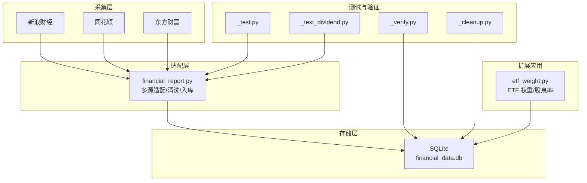
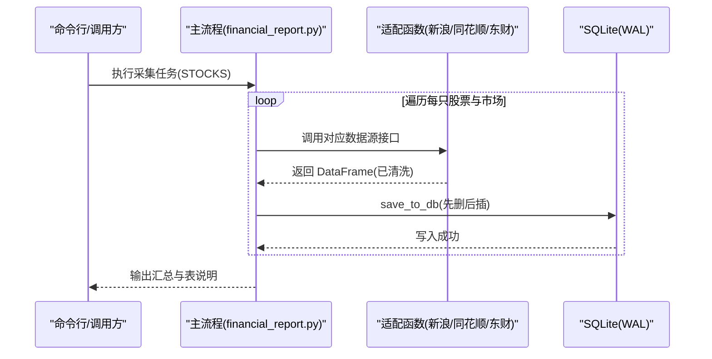
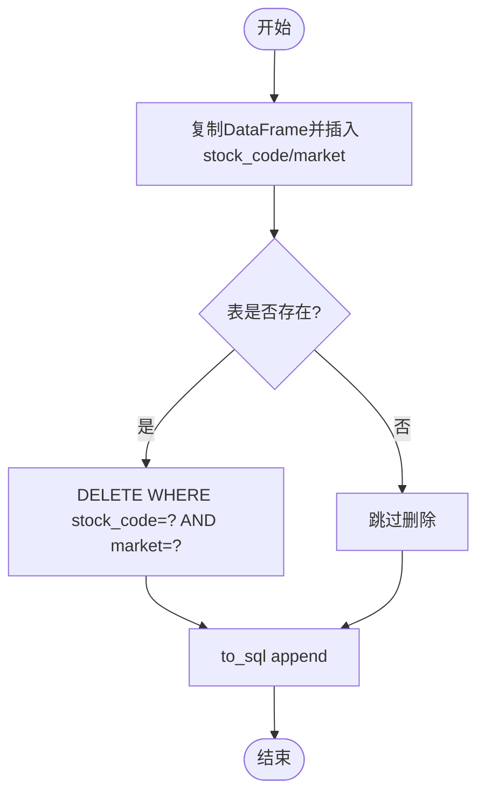
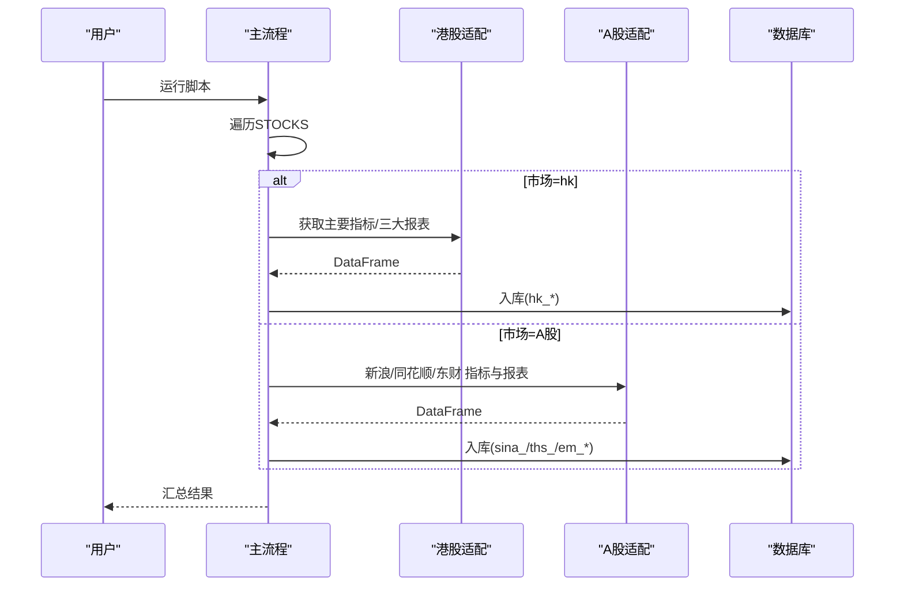
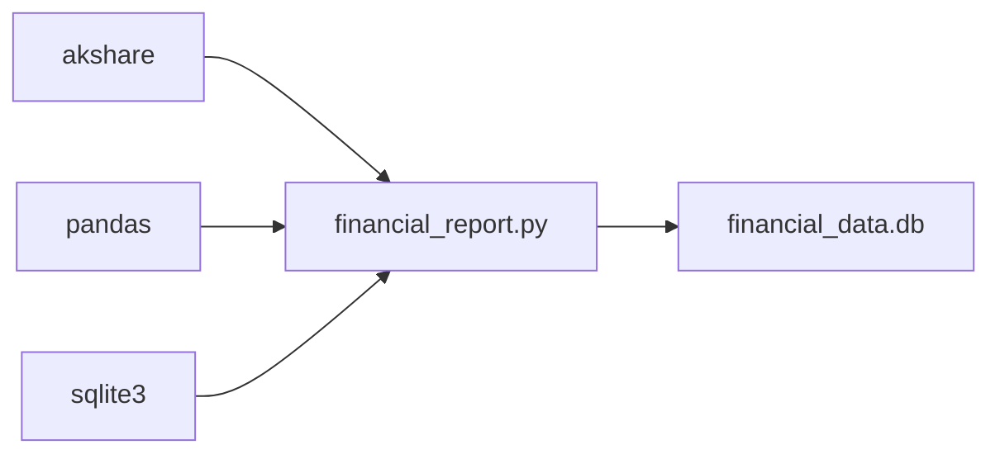
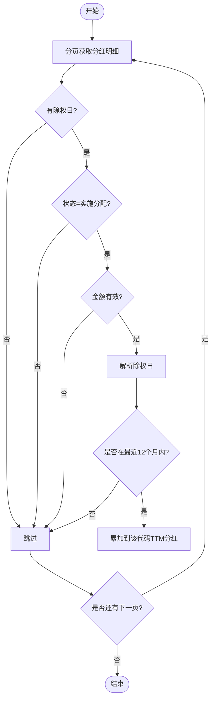

# 财务数据采集

<cite>
**本文引用的文件**
- [financial_report.py](file://financial_report.py)
- [_test.py](file://_test.py)
- [_test_dividend.py](file://_test_dividend.py)
- [_verify.py](file://_verify.py)
- [_cleanup.py](file://_cleanup.py)
- [etf_weight.py](file://etf_weight.py)
</cite>

## 目录
1. [简介](#简介)
2. [项目结构](#项目结构)
3. [核心组件](#核心组件)
4. [架构总览](#架构总览)
5. [详细组件分析](#详细组件分析)
6. [依赖关系分析](#依赖关系分析)
7. [性能与并发特性](#性能与并发特性)
8. [配置与使用指南](#配置与使用指南)
9. [错误处理与重试机制](#错误处理与重试机制)
10. [数据验证与质量检查](#数据验证与质量检查)
11. [分红数据处理](#分红数据处理)
12. [故障排查](#故障排查)
13. [结论](#结论)

## 简介
本仓库提供面向 A 股与港股的财务报表数据采集与存储工具，支持多数据源适配（新浪、同花顺、东方财富），统一格式后落库至本地 SQLite。系统覆盖三大报表（资产负债表、利润表、现金流量表）以及主要财务指标，并提供批量采集、增量更新、基础数据验证与分红数据处理能力。

## 项目结构
- financial_report.py：A 股/港股财报数据采集主模块，包含数据源适配、入库、主流程入口等
- _test.py：测试 akshare 接口可用性（如获取 A 股代码列表）
- _test_dividend.py：测试 A 股历史分红明细接口
- _verify.py：基于本地数据库的分红数据校验脚本
- _cleanup.py：清理旧表（用于重建或切换数据版本）
- etf_weight.py：ETF 权重与股息率相关逻辑（含对分红数据的聚合与 TTM 计算）

图表来源
- [financial_report.py:1-644](file://financial_report.py#L1-L644)
- [_test.py:1-6](file://_test.py#L1-L6)
- [_test_dividend.py:1-5](file://_test_dividend.py#L1-L5)
- [_verify.py:1-11](file://_verify.py#L1-L11)
- [_cleanup.py:1-11](file://_cleanup.py#L1-L11)
- [etf_weight.py:139-212](file://etf_weight.py#L139-L212)

章节来源
- [financial_report.py:1-644](file://financial_report.py#L1-L644)
- [_test.py:1-6](file://_test.py#L1-L6)
- [_test_dividend.py:1-5](file://_test_dividend.py#L1-L5)
- [_verify.py:1-11](file://_verify.py#L1-L11)
- [_cleanup.py:1-11](file://_cleanup.py#L1-L11)
- [etf_weight.py:139-212](file://etf_weight.py#L139-L212)

## 核心组件
- 数据源适配
  - 新浪财经：A 股财务指标宽表、三大报表宽表
  - 同花顺：A 股三大报表长表（按报告期）
  - 东方财富：A 股主要指标宽表、三大报表宽表；港股主要指标宽表、三大报表长表
- 统一字段约定
  - stock_code：纯数字股票代码
  - market：小写“sh/sz/hk”
  - year：报告年份（整数）
  - quarter：季度（1=一季报，2=半年报，3=三季报，4=年报）
- 数据存储
  - 本地 SQLite，WAL 模式提升并发读性能
  - 幂等写入：先删后插，避免重复
- 主流程
  - 批量采集：STOCKS 列表驱动
  - 增量更新：按 (stock_code, market) 维度删除旧数据再插入
  - 近 10 年筛选：统一时间窗口

章节来源
- [financial_report.py:74-144](file://financial_report.py#L74-L144)
- [financial_report.py:146-237](file://financial_report.py#L146-L237)
- [financial_report.py:239-479](file://financial_report.py#L239-L479)
- [financial_report.py:481-601](file://financial_report.py#L481-L601)

## 架构总览
整体采用“多源适配 + 统一清洗 + 幂等入库”的流水线式架构。各数据源通过 akshare 接口拉取原始数据，适配层进行时间过滤、quarter 推导、列名标准化，最终由 save_to_db 完成幂等写入。

图表来源
- [financial_report.py:481-601](file://financial_report.py#L481-L601)
- [financial_report.py:88-144](file://financial_report.py#L88-L144)

## 详细组件分析

### 数据源与接口映射
- 新浪财经（A 股）
  - 财务指标：stock_financial_analysis_indicator（宽表，约 86 项）
  - 三大报表：stock_financial_report_sina（宽表）
- 同花顺（A 股）
  - 三大报表：stock_financial_debt_new_ths / stock_financial_benefit_new_ths / stock_financial_cash_new_ths（长表，行=指标）
- 东方财富（A 股）
  - 主要指标：stock_financial_analysis_indicator_em（宽表，约 140 项）
  - 三大报表：stock_balance_sheet_by_report_em / stock_profit_sheet_by_report_em / stock_cash_flow_sheet_by_report_em（宽表）
- 东方财富（港股）
  - 主要指标：stock_financial_hk_analysis_indicator_em（宽表，约 36 项）
  - 三大报表：stock_financial_hk_report_em（长表，行=科目+金额）

章节来源
- [financial_report.py:8-23](file://financial_report.py#L8-L23)
- [financial_report.py:151-237](file://financial_report.py#L151-L237)
- [financial_report.py:245-383](file://financial_report.py#L245-L383)
- [financial_report.py:390-479](file://financial_report.py#L390-L479)

### 统一数据结构与字段含义
- 通用键
  - stock_code：纯数字代码
  - market：小写 sh/sz/hk
  - year：年份（int）
  - quarter：季度（1-4）
- 关键指标示例（不同数据源字段名不同，但语义一致）
  - 每股收益：EPSJB/摊薄每股收益
  - 净资产收益率：ROEJQ/加权ROE/净资产收益率(%)
  - 毛利率：XSMLL/销售毛利率(%)
  - 净利率：XSJLL/销售净利率(%)
  - 资产负债率：ZCFZL/资产负债率(%)
  - 流动比率/速动比率：LD/SD/流动比率/速动比率
- 三大报表
  - 资产负债表：总资产、总负债、所有者权益等
  - 利润表：营业总收入、净利润、扣非净利润等
  - 现金流量表：经营活动现金流净额、投资活动现金流净额、筹资活动现金流净额等
- 港股特有
  - 货币单位：CURRENCY（HKD/USD 等）
  - 长表字段：STD_ITEM_NAME（科目）、AMOUNT（金额）、FISCAL_YEAR（年结日）

章节来源
- [financial_report.py:47-52](file://financial_report.py#L47-L52)
- [financial_report.py:179-188](file://financial_report.py#L179-L188)
- [financial_report.py:223-234](file://financial_report.py#L223-L234)
- [financial_report.py:423-431](file://financial_report.py#L423-L431)
- [financial_report.py:449-457](file://financial_report.py#L449-L457)

### 入库与幂等更新
- 入库策略
  - 自动插入 stock_code/market 两列
  - market 统一转小写
  - 若目标表存在，则先按 (stock_code, market) 删除旧记录，再追加新数据
- 连接管理
  - 启用 WAL 模式，提高并发读取性能

图表来源
- [financial_report.py:88-124](file://financial_report.py#L88-L124)
- [financial_report.py:126-144](file://financial_report.py#L126-L144)

章节来源
- [financial_report.py:88-144](file://financial_report.py#L88-L144)

### 主流程与批量采集
- 配置区 STOCKS：每项为 (股票代码, 市场, 起始年)
- 流程分支
  - 港股：仅东方财富（主要指标 + 三大报表）
  - A 股：新浪（指标 + 三大报表）、同花顺（三大报表）、东方财富（指标 + 三大报表）
- 输出：打印采集进度、统计条数、表结构与字段说明

图表来源
- [financial_report.py:481-601](file://financial_report.py#L481-L601)

章节来源
- [financial_report.py:481-601](file://financial_report.py#L481-L601)

### 时间窗口与季度推导
- 时间窗口：统一筛选近 10 年数据
- 季度推导规则
  - 报告日月份在 1-3 → quarter=1
  - 4-6 → quarter=2
  - 7-9 → quarter=3
  - 10-12 → quarter=4
- 同花顺长表：从 report_period（如 "2024-4"）解析 year/quarter

章节来源
- [financial_report.py:277-286](file://financial_report.py#L277-L286)
- [financial_report.py:325-331](file://financial_report.py#L325-L331)
- [financial_report.py:371-378](file://financial_report.py#L371-L378)
- [financial_report.py:416-419](file://financial_report.py#L416-L419)
- [financial_report.py:467-474](file://financial_report.py#L467-L474)

## 依赖关系分析
- 外部依赖
  - akshare：统一的数据源封装
  - pandas：数据清洗与转换
  - sqlite3：本地持久化
- 内部耦合
  - 主流程依赖适配函数与入库函数
  - 适配函数之间相互独立，便于扩展新的数据源

图表来源
- [financial_report.py:67-73](file://financial_report.py#L67-L73)
- [financial_report.py:78-80](file://financial_report.py#L78-L80)

章节来源
- [financial_report.py:67-80](file://financial_report.py#L67-L80)

## 性能与并发特性
- 数据库层面
  - WAL 模式：允许并发读取，减少锁竞争
- 数据量控制
  - 近 10 年窗口限制，降低单次数据规模
- 写入策略
  - 幂等更新：先删后插，保证一致性
- 建议优化
  - 批量写入时开启事务提交
  - 对热点查询建立索引（如 stock_code、market、year、quarter）

章节来源
- [financial_report.py:126-144](file://financial_report.py#L126-L144)
- [financial_report.py:88-124](file://financial_report.py#L88-L124)

## 配置与使用指南
- 安装依赖
  - pip install akshare pandas
- 运行方式
  - 直接运行脚本：python financial_report.py
  - 作为模块导入：from financial_report import get_financial_report, get_conn, save_to_db
- 配置采集清单
  - 修改 STOCKS 列表，添加 (股票代码, 市场, 起始年)
  - 市场标识：sh（上海）、sz（深圳）、hk（港股）
- 读取示例
  - 单股查询、多股对比、年报筛选、长表按 metric_name 筛选、宽表直接取列等

章节来源
- [financial_report.py:54-65](file://financial_report.py#L54-L65)
- [financial_report.py:486-496](file://financial_report.py#L486-L496)
- [financial_report.py:602-642](file://financial_report.py#L602-L642)

## 错误处理与重试机制
- 当前实现
  - 适配层未内置显式异常捕获与重试
  - 主流程使用 try/finally 确保连接关闭
- 建议增强
  - 在网络请求处增加重试（指数退避）
  - 针对空结果或列缺失做容错与告警
  - 将失败记录写入日志表以便后续重跑

章节来源
- [financial_report.py:599-601](file://financial_report.py#L599-L601)

## 数据验证与质量检查
- 接口连通性验证
  - 使用 _test.py 验证 akshare 接口可用性与返回结构
- 分红数据验证
  - 使用 _test_dividend.py 拉取 A 股历史分红明细
  - 使用 _verify.py 校验本地 stock_dividend_detail 表数据完整性与频次统计
- 清理与重建
  - 使用 _cleanup.py 清理旧表，便于重新采集

章节来源
- [_test.py:1-6](file://_test.py#L1-L6)
- [_test_dividend.py:1-5](file://_test_dividend.py#L1-L5)
- [_verify.py:1-11](file://_verify.py#L1-L11)
- [_cleanup.py:1-11](file://_cleanup.py#L1-L11)

## 分红数据处理
- 数据来源
  - A 股：akshare.stock_history_dividend_detail（测试脚本中使用）
  - ETF 权重：etf_weight.py 中通过东方财富数据中心接口分页抓取已实施分红，并按最近 12 个月（TTM）累计每股分红
- 处理要点
  - 仅统计已实施且具备除权日的记录
  - 过滤无金额或日期格式异常的条目
  - 以代码为维度聚合，得到 TTM 每股分红
- 与财报的关系
  - 分红数据可与利润表中的“归属净利润”等指标结合，评估派息比例与股东回报

图表来源
- [etf_weight.py:139-212](file://etf_weight.py#L139-L212)

章节来源
- [_test_dividend.py:1-5](file://_test_dividend.py#L1-L5)
- [_verify.py:1-11](file://_verify.py#L1-L11)
- [etf_weight.py:139-212](file://etf_weight.py#L139-L212)

## 故障排查
- 常见问题
  - 接口返回为空或列缺失：检查 akshare 版本与接口变更
  - 时间范围不符合预期：确认近 10 年筛选逻辑与报告日解析
  - 写入失败或重复：确认表是否存在、幂等删除条件是否正确
- 定位方法
  - 查看控制台打印的条数与列信息
  - 使用 _verify.py 与 _cleanup.py 辅助验证与重建
  - 检查 SQLite 表结构与数据样例

章节来源
- [financial_report.py:172-188](file://financial_report.py#L172-L188)
- [financial_report.py:210-234](file://financial_report.py#L210-L234)
- [financial_report.py:277-286](file://financial_report.py#L277-L286)
- [financial_report.py:88-124](file://financial_report.py#L88-L124)
- [_verify.py:1-11](file://_verify.py#L1-L11)
- [_cleanup.py:1-11](file://_cleanup.py#L1-L11)

## 结论
本方案通过统一的适配层与幂等入库策略，实现了 A 股与港股财报的多源采集与标准化存储。近 10 年时间窗口与季度推导保证了数据的一致性与可比性。配合测试与验证脚本，可快速完成数据质量检查与问题定位。未来可在网络层引入重试与监控、在数据库层完善索引与审计，进一步提升稳定性与可观测性。