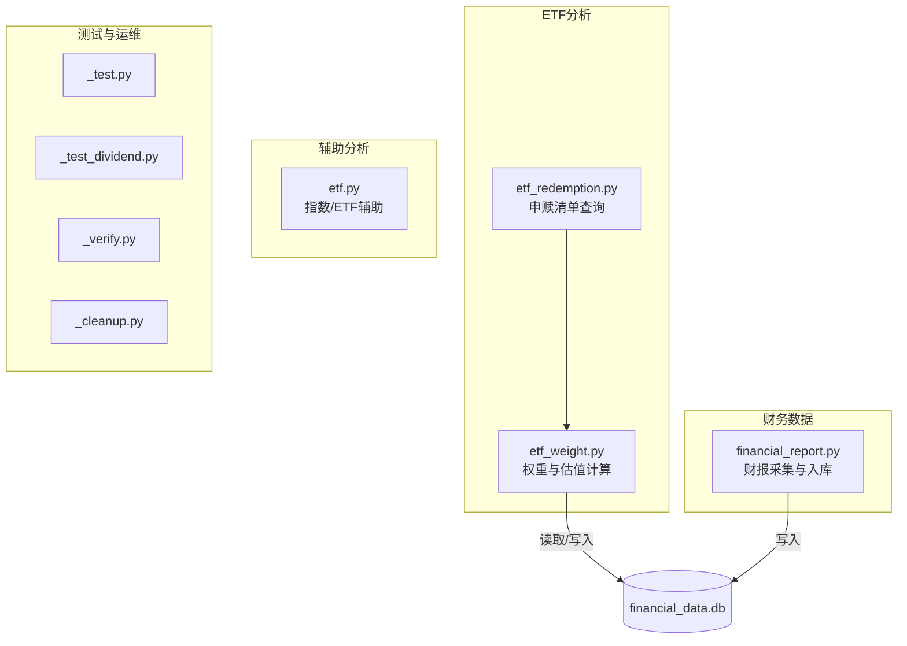
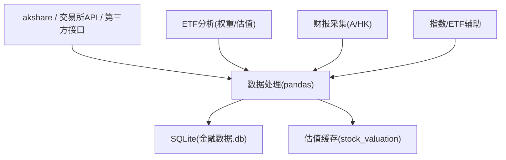
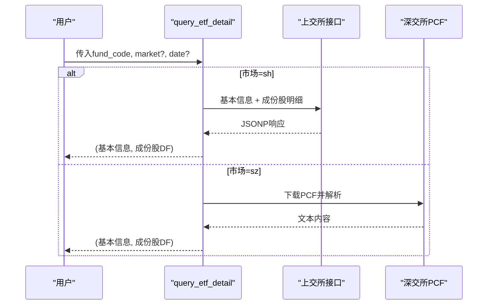
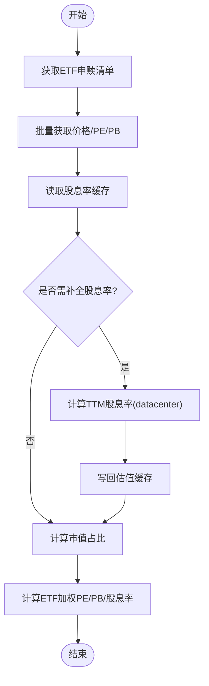
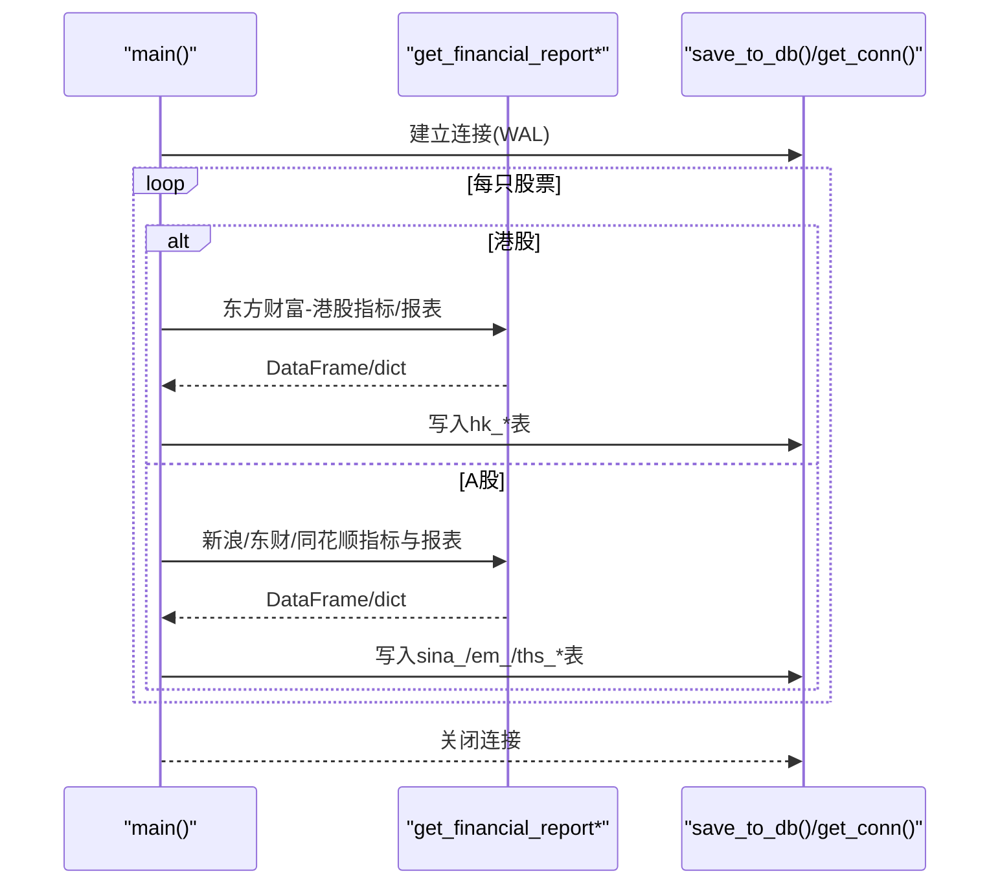
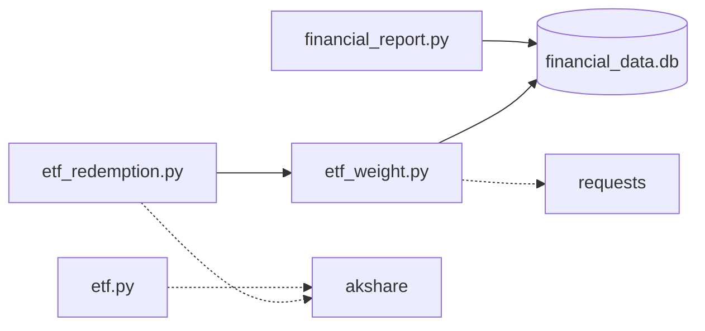

# 项目概述

<cite>
**本文引用的文件**   
- [etf.py](file://etf.py)
- [financial_report.py](file://financial_report.py)
- [etf_weight.py](file://etf_weight.py)
- [etf_redemption.py](file://etf_redemption.py)
- [_test.py](file://_test.py)
- [_test_dividend.py](file://_test_dividend.py)
- [_verify.py](file://_verify.py)
- [_cleanup.py](file://_cleanup.py)
</cite>

## 目录
1. [简介](#简介)
2. [项目结构](#项目结构)
3. [核心组件](#核心组件)
4. [架构总览](#架构总览)
5. [详细组件分析](#详细组件分析)
6. [依赖关系分析](#依赖关系分析)
7. [性能与可用性考量](#性能与可用性考量)
8. [故障排查指南](#故障排查指南)
9. [结论](#结论)
10. [附录：使用场景与工作流示例](#附录使用场景与工作流示例)

## 简介
本项目是一套面向A股与港股的“ETF投资分析 + 财务数据采集 + 行情数据获取”工具集，围绕以下目标构建：
- ETF维度：自动抓取上交所/深交所ETF申赎清单，计算成份股权重、ETF加权PE/PB/股息率等估值指标。
- 财务维度：从多源（新浪、同花顺、东方财富）采集A股/港股财报及主要指标，统一入库SQLite，便于后续分析与回测。
- 行情维度：批量获取股票最新价、PE、PB，并基于分红记录计算TTM股息率；提供本地缓存以降低网络请求频率。

技术栈以Python为核心，广泛使用akshare、pandas进行数据拉取与处理，sqlite3作为本地持久化存储，requests用于直接访问交易所或第三方接口。整体设计强调“可插拔的数据源 + 统一的本地库 + 可复用的计算模块”，适合初学者快速上手，也便于扩展更多市场与指标。

## 项目结构
仓库采用按功能划分的扁平结构，每个脚本聚焦一个主题：
- etf_redemption.py：ETF申赎清单查询（SSE/SZSE），返回基本信息与成份股明细。
- etf_weight.py：基于申赎清单计算成份股权重与ETF加权估值指标，并提供批量行情与股息率计算。
- financial_report.py：A股+港股财报与主要指标采集、清洗与入库。
- etf.py：指数/ETF相关辅助分析（如红利指数加权估值）。
- _test*.py/_verify.py/_cleanup.py：测试、验证与清理脚本。

图表来源
- [etf_redemption.py:1-683](file://etf_redemption.py#L1-L683)
- [etf_weight.py:1-674](file://etf_weight.py#L1-L674)
- [financial_report.py:1-644](file://financial_report.py#L1-L644)
- [etf.py:1-126](file://etf.py#L1-L126)

章节来源
- [etf_redemption.py:1-683](file://etf_redemption.py#L1-L683)
- [etf_weight.py:1-674](file://etf_weight.py#L1-L674)
- [financial_report.py:1-644](file://financial_report.py#L1-L644)
- [etf.py:1-126](file://etf.py#L1-L126)

## 核心组件
- ETF申赎清单查询（etf_redemption.py）
  - 支持上交所JSONP接口与深交所PCF文本解析，统一封装为“基本信息 + 成份股明细”。
  - 提供列表查询、单只ETF详情、下载PCF、结果展示与CSV导出等功能。
- ETF权重与估值（etf_weight.py）
  - 基于申赎清单与成份股数量，结合收盘价计算市值占比。
  - 通过腾讯财经/东方财富接口批量获取价格、PE、PB，并通过东方财富datacenter-web计算TTM股息率。
  - 将估值数据落盘至stock_valuation表，实现当日缓存与增量补全。
  - 输出ETF整体PE/PB（调和平均口径）与加权股息率（算术加权口径）。
- 财报数据采集（financial_report.py）
  - 覆盖A股（新浪、同花顺、东方财富）与港股（东方财富）的多源接口。
  - 统一字段约定（stock_code、market、year、quarter），幂等更新策略，WAL模式提升并发读性能。
  - 主程序入口支持批量采集多只股票，打印统计信息并保存至数据库。
- ETF/指数辅助分析（etf.py）
  - 演示如何基于持仓与财务指标计算指数加权估值，以及调用指数价值接口。

章节来源
- [etf_redemption.py:1-683](file://etf_redemption.py#L1-L683)
- [etf_weight.py:1-674](file://etf_weight.py#L1-L674)
- [financial_report.py:1-644](file://financial_report.py#L1-L644)
- [etf.py:1-126](file://etf.py#L1-L126)

## 架构总览
系统由“数据接入层 + 数据处理层 + 本地存储层 + 应用层”构成：
- 数据接入层：akshare、交易所API、第三方行情接口（腾讯、东方财富）。
- 数据处理层：pandas进行清洗、对齐、聚合与指标计算。
- 本地存储层：SQLite（WAL模式），包含财报表族与估值缓存表。
- 应用层：命令行工具与可复用函数，支撑ETF分析、财报入库与日常验证。

图表来源
- [etf_redemption.py:1-683](file://etf_redemption.py#L1-L683)
- [etf_weight.py:1-674](file://etf_weight.py#L1-L674)
- [financial_report.py:1-644](file://financial_report.py#L1-L644)
- [etf.py:1-126](file://etf.py#L1-L126)

## 详细组件分析

### ETF申赎清单查询（etf_redemption.py）
- 能力边界
  - 上交所：列表查询、单只ETF详情、PCF下载。
  - 深交所：列表查询、PCF下载与文本解析。
- 关键流程
  - 列表查询：构造参数→HTTP请求→解析JSON/HTML→DataFrame。
  - 详情查询：根据市场选择对应接口，返回基本信息与成份股明细。
  - PCF解析：状态机识别头部/上一交易日/当日信息/成份股表头/数据行。
- 错误处理
  - 网络异常捕获、JSONP提取失败、编码问题（GBK）容错。
- 输出
  - 标准化字段：基金代码、名称、交易日期、市场、成份股明细等。

图表来源
- [etf_redemption.py:529-549](file://etf_redemption.py#L529-L549)
- [etf_redemption.py:114-212](file://etf_redemption.py#L114-L212)
- [etf_redemption.py:347-476](file://etf_redemption.py#L347-L476)

章节来源
- [etf_redemption.py:1-683](file://etf_redemption.py#L1-L683)

### ETF权重与估值（etf_weight.py）
- 能力边界
  - 输入：ETF基金代码（可选市场与日期）。
  - 输出：ETF基本信息、带占比的成份股明细、ETF加权PE/PB/股息率。
- 关键流程
  - 获取申赎清单 → 批量行情（价格/PE/PB）→ 读取本地股息率缓存 → 缺失时计算TTM股息率 → 写回缓存 → 计算市值占比与ETF加权指标。
- 数据源与容错
  - 优先腾讯批量接口，不足时用东方财富兜底；对网络异常重试与分页控制。
  - 股息率通过datacenter-web近12个月实施分配记录计算TTM。
- 本地缓存
  - stock_valuation表：按日期与股票代码去重，避免重复请求。

图表来源
- [etf_weight.py:446-510](file://etf_weight.py#L446-L510)
- [etf_weight.py:393-443](file://etf_weight.py#L393-L443)
- [etf_weight.py:513-558](file://etf_weight.py#L513-L558)
- [etf_weight.py:111-237](file://etf_weight.py#L111-L237)

章节来源
- [etf_weight.py:1-674](file://etf_weight.py#L1-L674)

### 财报数据采集（financial_report.py）
- 能力边界
  - A股：新浪（指标+三大报表）、同花顺（长表三大报表）、东方财富（指标+宽表三大报表）。
  - 港股：东方财富（指标+长表三大报表）。
- 数据模型
  - 统一字段：stock_code、market（小写）、year、quarter。
  - 表族命名：sina_* / ths_* / em_* / hk_*，区分市场与数据源。
- 入库策略
  - 幂等更新：先删除旧记录再插入，保证多次运行一致。
  - WAL模式：提高并发读性能。
- 主流程
  - 遍历STOCKS配置，按市场分支执行不同数据源采集，打印进度与统计。

图表来源
- [financial_report.py:485-600](file://financial_report.py#L485-L600)
- [financial_report.py:88-143](file://financial_report.py#L88-L143)
- [financial_report.py:151-236](file://financial_report.py#L151-L236)
- [financial_report.py:245-382](file://financial_report.py#L245-L382)
- [financial_report.py:390-478](file://financial_report.py#L390-L478)

章节来源
- [financial_report.py:1-644](file://financial_report.py#L1-L644)

### ETF/指数辅助分析（etf.py）
- 能力边界
  - 基于持仓与财务指标计算指数加权市盈率、市净率、股息率。
  - 调用指数价值接口，展示特定指数当前值。
- 典型用法
  - 选取某指数/ETF，获取其季度持仓，合并前10与后40名，叠加个股指标并按权重加权求和。

章节来源
- [etf.py:1-126](file://etf.py#L1-L126)

## 依赖关系分析
- 外部依赖
  - akshare：A/HK财务与指数数据。
  - pandas：数据清洗与聚合。
  - sqlite3：本地持久化。
  - requests：直接访问交易所与第三方接口。
- 内部耦合
  - etf_weight.py 依赖 etf_redemption.py 获取申赎清单。
  - etf_weight.py 与 financial_report.py 共享同一SQLite路径，但职责分离（前者侧重估值缓存，后者侧重财报表族）。
  - etf.py 独立运行，主要用于演示与分析。

图表来源
- [etf_weight.py:23-24](file://etf_weight.py#L23-L24)
- [financial_report.py:67-72](file://financial_report.py#L67-L72)
- [etf.py:1-5](file://etf.py#L1-L5)

章节来源
- [etf_weight.py:1-674](file://etf_weight.py#L1-L674)
- [financial_report.py:1-644](file://financial_report.py#L1-L644)
- [etf.py:1-126](file://etf.py#L1-L126)

## 性能与可用性考量
- 网络请求优化
  - 批量接口优先（腾讯批量行情），失败自动降级（东方财富兜底）。
  - datacenter-web分页拉取分红记录，设置最大页数与间隔，避免过度请求。
- 本地缓存
  - 估值缓存按日期与股票代码去重，减少重复计算与请求。
- 数据库性能
  - SQLite启用WAL模式，提升并发读性能。
  - 幂等写入策略，确保多次运行一致性。
- 可扩展性
  - 新增数据源只需在相应模块增加函数与映射，主流程保持简洁。

## 故障排查指南
- 常见网络问题
  - 接口超时/反爬：检查User-Agent、Referer、Host等请求头；适当增加重试与休眠时间。
  - JSONP解析失败：确认正则提取逻辑与响应格式变化。
- 数据不一致
  - 字段名变更：核对akshare接口文档与返回列名。
  - 编码问题（GBK）：PCF文本解析需正确解码。
- 数据库问题
  - 表不存在：首次运行会自动创建；若手动清理，请重新运行采集脚本。
  - 写入冲突：幂等更新已内置，若仍异常，检查约束与索引。
- 验证与清理
  - 使用_verify.py查看数据库表结构与样例数据。
  - 使用_cleanup.py清理历史表以便重建。

章节来源
- [etf_redemption.py:70-91](file://etf_redemption.py#L70-L91)
- [etf_redemption.py:376-385](file://etf_redemption.py#L376-L385)
- [financial_report.py:114-123](file://financial_report.py#L114-L123)
- [financial_report.py:126-143](file://financial_report.py#L126-L143)
- [_verify.py:1-11](file://_verify.py#L1-L11)
- [_cleanup.py:1-11](file://_cleanup.py#L1-L11)

## 结论
本项目以“ETF分析 + 财报采集 + 行情获取”为主线，构建了从数据接入到本地存储再到指标计算的完整闭环。通过多源冗余与本地缓存，提升了鲁棒性与效率；通过统一字段与幂等入库，保证了数据质量与可维护性。对于初学者而言，可按“先跑通ETF权重计算，再扩展财报采集”的路径逐步深入。

## 附录：使用场景与工作流示例

- 场景一：计算沪深300ETF（510300）的成份股权重与ETF加权估值
  - 步骤
    - 运行ETF权重脚本，指定基金代码与市场（自动判断）。
    - 脚本将拉取申赎清单、批量获取行情与股息率、计算占比与ETF加权指标。
  - 参考路径
    - [etf_weight.py:640-673](file://etf_weight.py#L640-L673)
    - [etf_weight.py:446-510](file://etf_weight.py#L446-L510)

- 场景二：批量采集A股与港股财报数据
  - 步骤
    - 编辑financial_report.py中的STOCKS列表，添加目标股票与市场。
    - 运行脚本，等待采集完成，数据存入financial_data.db。
  - 参考路径
    - [financial_report.py:485-600](file://financial_report.py#L485-L600)

- 场景三：验证数据库内容与清理历史表
  - 步骤
    - 使用_verify.py查询样例数据。
    - 如需重建，使用_cleanup.py删除旧表后再运行采集。
  - 参考路径
    - [_verify.py:1-11](file://_verify.py#L1-L11)
    - [_cleanup.py:1-11](file://_cleanup.py#L1-L11)

- 场景四：快速验证akshare可用性与基础数据
  - 步骤
    - 运行_test.py，打印A股代码与名称列表。
  - 参考路径
    - [_test.py:1-6](file://_test.py#L1-L6)

- 场景五：查看个股分红明细（示例：贵州茅台）
  - 步骤
    - 运行_test_dividend.py，打印最近分红明细。
  - 参考路径
    - [_test_dividend.py:1-5](file://_test_dividend.py#L1-L5)